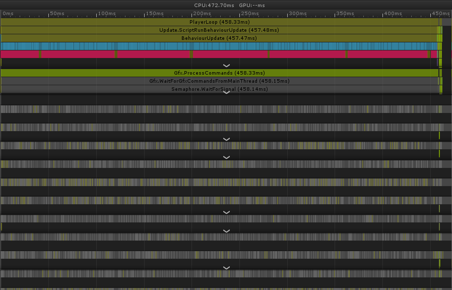
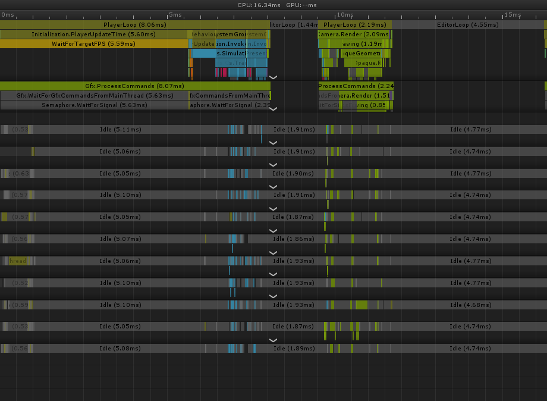

# Highway Racers ECS port postmortem

## ECS port

Main phases identified in car MonoBehvaior in pre-ECS code are calculating distances between cars, updating positions, and switching lanes.

ECS port is using only single `JobComponentSystem` called `CarUpdateSystem`. `CarUpdateSystem` is part of `SimulationSystemGroup`, and because it's updating LocalToWorld transform it's placed to be updated before `TransformSystemGroup`.

In ECS port we use component `LaneXTag`, where `X` is lane number, to group cars in lanes. This is used in the first entity query pass when we gather all current car positions `PositionDistJob`. After gathering positions we sort them in descending order `SortJob`, and then we calculate distances of car in front of current car `CalcDistancesJob`. In this job we make sure that we handle wrapping lane case, and single car in lane case (where is no car in front). Final phase is to update positions, and logic, which happens inside `PositionUpdateJob`. During logic update cars might decide to switch lane. Since we're using component tags decision is queued for the next frame, and current lane component tag is removed and new lane tag is added.

## Performance analysis

ECS port frame time is 28-30 times faster (Number of Cars: 800, Highway Size: 700), bounded by renderer. Pre ECS port 457ms BehaviourUpdate went down to 0.694ms, and SimulationUpdateGroup takes 0.899ms, improvement over 286 times.

Pre-ECS:

ECS port:

There are other potential optimizations to ECS port that could exploited. One would be to further reduce state of each car to single distance, and to keep only position of first car in the lane. Other cars would just change relative distance to car in front, and they would move on lane relative to first car in lane. Only time when distances would need to be recalculate would be when car changes lane, and only for car directly behind and in front of car that's swiching lane.
