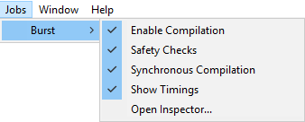
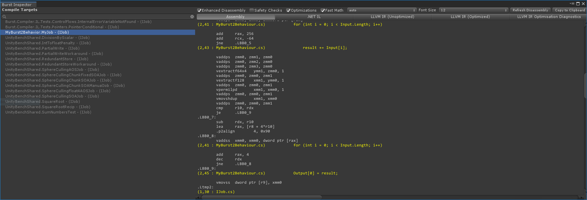
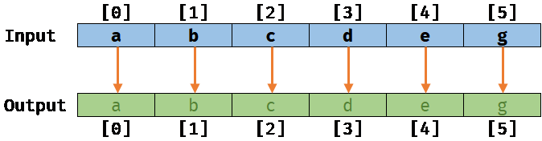
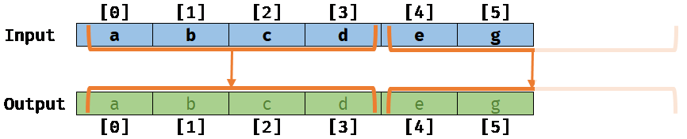
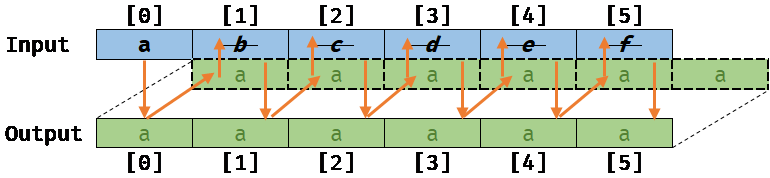
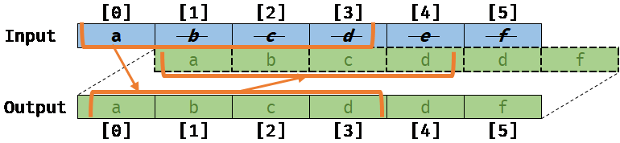
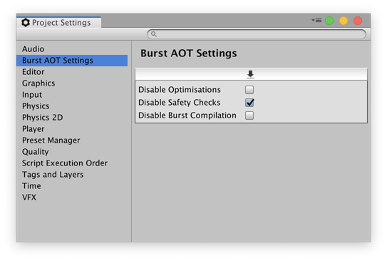

# **_Burst User Guide_**

Burst is a compiler that translates from IL/.NET bytecode to highly optimized native code using LLVM. It is released as a Unity package and integrated into Unity using the Unity Package Manager.

# Quick Start

## Compile a Job with the Burst compiler

Burst is primarily designed to work efficiently with the Job system. 

You can start using the Burst compiler in your code by simply decorating a Job struct with the attribute `[BurstCompile]`

```c#
using Unity.Burst;
using Unity.Collections;
using Unity.Jobs;
using UnityEngine;

public class MyBurst2Behavior : MonoBehaviour
{
    void Start()
    {
        var input = new NativeArray<float>(10, Allocator.Persistent);
        var output = new NativeArray<float>(1, Allocator.Persistent);
        for (int i = 0; i < input.Length; i++)
            input[i] = 1.0f * i;

        var job = new MyJob
        {
            Input = input,
            Output = output
        };
        job.Schedule().Complete();

        Debug.Log("The result of the sum is: " + output[0]);
        input.Dispose();
        output.Dispose();
    }

    // Using BurstCompile to compile a Job with Burst
    // Set CompileSynchronously to true to make sure that the method will not be compiled asynchronously
    // but on the first schedule
    [BurstCompile(CompileSynchronously = true)]
    private struct MyJob : IJob
    {
        [ReadOnly]
        public NativeArray<float> Input;

        [WriteOnly]
        public NativeArray<float> Output;

        public void Execute()
        {
            float result = 0.0f;
            for (int i = 0; i < Input.Length; i++)
            {
                result += Input[i];
            }
            Output[0] = result;
        }
    }
}
```

By default (only within the Editor - See [AOT vs JIT](#just-in-time-jit-vs-ahead-of-time-aot-compilation)), Burst JIT compiles jobs asynchronously, but  the example above uses the option `CompileSynchronously = true` to make sure that the method is compiled on the first schedule. In general, you should use asynchronous compilation. See [`[BurstCompile]` options](#synchronous-compilation)

<a name="jobs-burst-menu"></a>
## Jobs/Burst Menu

The Burst package adds a few menu entries to the Jobs menu for controlling Burst behavior:



- **Enable Compilation**: When checked, Burst compiles Jobs and Burst custom delegates that are tagged with the attribute `[BurstCompile]`. Default is checked.
- **Enable Safety Checks**: When checked, Burst enables safety checks on code that uses collection containers (e.g `NativeArray<T>`). Checks include job data dependency and container indexes out of bounds. Note that this option disables the noaliasing performance optimizations, by default. Default is checked.
- **Synchronous Compilation**: When checked, Burst will compile synchronously - See [`[BurstCompile]` options](#synchronous-compilation). Default is unchecked.
- **Show Timings**: When checked, Burst logs the time it takes to JIT compile a Job in the Editor. Default is unchecked.
- **Open Inspector...**: Opens the [Burst Inspector Window](#burst-inspector).

## Burst Inspector

The Burst Inspector window displays all the Jobs and other Burst compile targets in the project. Open the Inspector from the Jobs menu (**Jobs** > **Burst Inspector**).

The inspector allows you to view all the Jobs that can be compiled, you can also then check the generated intermediate and native assembly code.



On the left pane of the window, **Compile Targets** provides an alphabetically sorted list of the Jobs in the project that Burst can compile. Note that the disabled Jobs in the list don't have the `[BurstCompile]` attribute.

On the right pane, the window displays options for viewing the assembly and intermediate code for the selected compile target.

**To view the disassembly for a Job:**

1. Select an active compile target from the _left pane_.
2. On the _right pane_, press the button **Refresh Disassembly**
3. Switch between the different tabs to display the details:
   * **Assembly** provides the final optimized native code generated by Burst
   * **.NET IL** provides a view on the original .NET IL extracted from the Job method
   * **LLVM IR (Unoptimized)** provides a view on the internal LLVM IR before optimizations.
   * **LLVM IR (Optimized)** provides a view on the internal LLVM IR after optimizations.
   * **LLVM IR Optimization Diagnostics** provides detailed LLVM diagnostics of the optimizations (i.e if they succeeded or failed).
4. You can also turn on different options:
   * The **Enhanced Disassembly** option inserts the source C# statements into the **Assembly** view, correlating the assembly code with the source file, line and statement.
   * The **Safety Checks** option generates code that includes container access safety checks (e.g check if a job is writing to a native container that is readonly).
   * The **Optimizations** option allows the compiler to optimize the code.
   * The **Fast Math** option allows the compiler to collapse mathematical operations to be more efficient, at the expense of not respecting an exact mathematical correctness (See the [compiler relaxation option](#compiler-relaxation))

> NOTE: While the inspector can disassemble for `AVX`, `AVX2`, `AVX512` CPU architectures, these architectures are currently not supported by Burst at runtime. They will fallback to `SSE4`

## Command-line Options

You can pass the following options to the Unity Editor on the command line to control Burst:

- `--burst-disable-compilation` — turns Burst off.
- `--burst-force-sync-compilation` — Burst always compiles synchronously. See [`[BurstCompile]` options](#synchronous-compilation).

# Just-In-Time (JIT) vs Ahead-Of-Time (AOT) Compilation

When working on your projects in the editor (play mode), burst works in a Just-In-Time (JIT) fashion. Burst will compile your code at the point that it is to be used. By default this is done asnychronously which means your code will be running under the default mono JIT until the compilation by burst has been completed.
You can control this behaviour via [`[BurstCompile]` options](#synchronous-compilation).

However when you build your project into a Standalone Player, burst will instead compile all the supported code Ahead-Of-Time (AOT). AOT compilation at present, requires access to some linker tools for the respective platforms (similar to the requirements of IL2CPP). See [Burst AOT Requirements](#burst-aot-requirements).

See [Standalone Player Support](#standalone-player-support).

# C#/.NET Language Support

Burst is working on a subset of .NET that doesn't allow the usage of any managed objects/reference types in your code (class in C#).

The following sections gives more details about the constructs actually supported by Burst.

## Supported .NET types

### Primitive types

Burst supports the following primitive types:

- `bool`
- `sbyte`/`byte`
- `short`/`ushort`
- `int`/`uint`
- `long`/`ulong`
- `float`
- `double`

Burst does not support the following types:

- `char` (this will be supported in a future release)
- `string` as this is a managed type
- `decimal`

### Vector types

Burst is able to translate vector types from `Unity.Mathematics` to native SIMD vector types with first class support for optimizations:

- `bool2`/`bool3`/`bool4`
- `uint2`/`uint3`/`uint4`
- `int2`/`int3`/`int4`
- `float2`/`float3`/`float4`

> Note that for performance reasons, the 4 wide types (`float4`, `int4`...) should be preferred

### Enum types

Burst supports all enums including enums with a specific storage type (e.g `public enum MyEnum : short`)

> Burst doesn't currently support `Enum` methods (e.g `Enum.HasFlag`)

### Struct types

Burst supports regular structs with any field with supported types.

Burst supports fixed array fields.

Regarding the layout, `LayoutKind.Sequential` and `LayoutKind.Explicit` are both supported

> The `StructLayout.Pack` packing size is not supported

The `System.IntPtr` and `UIntPtr` are supported natively as an intrinsic struct directly representing pointers.

### Pointer types

Burst supports any pointer types to any Burst supported types

### Generic types

Burst supports generic types used with structs. 
Specifically, it supports full instantiation of generic calls for generic types with interface constraints (e.g when a struct with a generic parameter requiring to implement an interface)

### Array types

Managed arrays are not supported by Burst. You should use instead a native container, `NativeArray<T>` for instance.

Burst supports reading from readonly managed arrays loaded only from static readonly fields:

```c#
[BurstCompile]
public struct MyJob : IJob {
    private static readonly int[] _preComputeTable = new int[] {1,2,3,4};

    public int Index {get; set;}

    public void Execute()
    {
        int x = _preComputeTable[0];
        int z = _preComputeTable[Index];
    }
}
```

Accessing a static readonly managed array has with the following restrictions:

- It is not allowed to pass this static managed array around (e.g method argument), you have to use it directly
- Elements of a readonly static managed arrays should not be modified by a C# code external to jobs, as the Burst compiler is making a readonly copy of the data at compilation time
- Array of structs are also supported at the condition that the struct constructor doesn't have any control flow (e.g `if`/`else`) or is throwing an exception

## Language Support

Burst supports most of the expressions and statements:

- Regular C# control flows:
  - `if`/`else`/`switch`/`case`/`for`/`while`/`break`/`continue`
- Extension methods
- Unsafe code, pointers manipulation...etc.
- Instance methods of structs
- By ref/out parameters
- DllImport and internal calls
- Limited support for `throw` expressions, assuming simple throw patterns (e.g `throw new ArgumentException("Invalid argument")`). In that case, we will try to extract the static string exception message to include it in the generated code.
- Some special IL opcodes like `cpblk`, `initblk`, `sizeof`
- Loading from static readonly fields

Burst does not support:

- The `calli` instruction (This should be supported in a future version) 
- `catch`
- `try`/`finally` (which will come at some point)
- `foreach` as it is requiring `try`/`finally` (This should be supported in a future version)
- Storing to static fields
- Any methods related to managed objects (e.g string methods...etc.)

### Intrinsics

#### `System.Math`

Burst provides an intrinsic for all methods declared by `System.Math` except for the following methods that are not supported:
 - `double IEEERemainder(double x, double y)` 
 - `Round(double value, int digits)`

#### `System.IntPtr`

Burst supports all methods of `System.IntPtr`/`System.UIntPtr`, including the static fields `IntPtr.Zero` and `IntPtr.Size`

#### `System.Threading.Interlocked`

Burst supports atomic memory intrinsics for all methods provided by `System.Threading.Interlocked` (e.g `Interlocked.Increment`...etc.)

#### `NativeArray<T>`

Burst supports intrinsics with `noalias` only for the following `NativeArray<T>` methods:

- `int Length { get; }`
- `T this[int index] { get; set; }`

Any usage of other members will disable `noalias` optimizations automatically.

# Debugging

> NOTE: Burst does not provide currently a dedicated debugger for Burst compiled Jobs. 
>
> If you need to debug a job, you will need to disable the Burst compiler or comment the `[BurstCompile]` attribute from your job and attach a **regular .NET managed debugger**

# Advanced usages

## BurstDiscard attribute

When running some code in the full C# (not inside a Burst compiled code), you may want to use some managed objects but you would like to not compile these portion of code when compiling within Burst.

To mitigate this, you can use the `[BurstDiscard]` attribute on a method:

```c#
[BurstCompile]
public struct MyJob : IJob {
    
    public void Execute()
    {
        // Only executed when running from a full .NET runtime
        // this method call will be discard when compiling this job with
        // [BurstCompile] attribute
        MethodToDiscard();
    }

    [BurstDiscard]
    private static void MethodToDiscard(int arg)
    {
        Debug.Log($"This is a test: {arg});
    }
}
```

> A method with `[BurstDiscard]` cannot have a return value or an `ref/out` parameter

## Synchronous compilation

By default, the Burst compiler in the editor will compile the jobs asynchronously.

You can change this behavior by setting `CompileSynchronously = true` for the `[BurstCompile]` attribute:

```c#
[BurstCompile(CompileSynchronously = true)]
public struct MyJob : IJob
{
    // ...
}
```

## Dynamic dispatch based on runtime CPU features 

For all `x86`/`x64` CPU desktop platforms, Burst will dispatch jobs to different version compiled by taking into account CPU features available at runtime. 

Currently for for `x86` and `x64` CPU, Burst is supporting at runtime only `SSE2` and `SSE4` instruction sets. 

For example, with dynamic CPU dispatch, if your CPU is supports `SSE3` and below, Burst will select `SSE2` automatically.

See the table in the section [Burst AOT Requirements](#burst-aot-requirements) for more details about the supported CPU architectures.

# Optimization Guidelines

## Memory Aliasing and `noalias` 

Memory aliasing is an important concept that can lead to significant optimizations for a compiler that is aware about how data is being used by the code.

### The problem

Let's take a simple example of a job copying data from an input array to an output array:


```c#
[BurstCompile]
private struct CopyJob : IJob
{
    [ReadOnly]
    public NativeArray<float> Input;

    [WriteOnly]
    public NativeArray<float> Output;

    public void Execute()
    {
        for (int i = 0; i < Input.Length; i++)
        {
            Output[i] = Input[i];
        }
    }
}
```
#### No memory aliasing:

If the two arrays `Input` and `Output` are not slightly overlapping, meaning that their respective memory location are **not aliasing**, we will get the following result after running this job on a sample input/output:



#### No memory aliasing with the auto-vectorizer:

Now, if the compiler is **noalias aware**, it will be able to optimize the previous scalar loop (working at a scalar level) by what is called **vectorizing**: The compiler will rewrite the loop on your behalf to process elements by a small batch (working at a vector level, 4 by 4 elements for example) like this:



#### Memory aliasing:

Next, if for some reasons (that is not directly easy to introduce with the JobSystem today), the Output array is actually overlapping the Input array by one element off (e.g `Output[0]` points actually to `Input[1]`) meaning that memory are **aliasing**, we will get the following result when running the `CopyJob` (assuming that the auto-vectorizer is not running):



#### Memory aliasing with invalid vectorized code:

Worse, if the compiler was not aware of this memory aliasing, it would still try to auto-vectorize the loop, and we would get the following result, which is different from the previous scalar version:



The result of this code would be invalid and could lead to very serious bugs if they are not identified by the compiler.

### The solution with `burst` and the JobSystem

To ensure that a Job can be safely vectorized (when there is a loop), Burst relies on:

- The assumption brought by the safety of the JobSystem regarding the data in input/output that you can specify in the Job: It means that by default, all data accessed safety through a job are not aliasing
- A further analysis of Burst on the code to make sure that the code is also safe

The alias analysis in Burst is currently relying on a few constraints that your code needs to follow in order to let the auto-vectorizer to work correctly:

- Only `NativeArray<T>` is used and only the property `Length` and or the indexer `this[index]` are used
- Native containers (e.g `NativeArray<T>`) or a struct containing indirectly a container should not be copied to a local variable
- Native containers can be passed by value to a method argument, at the condition that all arguments are coming from identified source, either from fields or other arguments from static methods, but not both and that the method is static
- Native Containers or a struct containing indirectly a container are not stored to a field of a struct
- Assuming that the option **Enable Burst Safety Checks** is unchecked in the [Jobs menu](#jobsburst-menu)

We are expecting to improve the alias analysis with a finer grained model that will allow to relax a few of these constraints.

### Example of generated code with noalias analysis

Let's take the example of the `CopyJob`, with the compiled to native code with the `noalias` analysis disabled.

The following loop is the result of the compilation `x64` using `AVX2` instructions with **noalias analysis enabled**:
(Note that we are only copying the core loop, not the full prolog, epilog of the whole method)

The instruction `vmovups` is moving 8 floats  here, so a single auto-vectorized loop is now moving 4 x 8 = **32 floats copied per loop iteration** instead of one! (So there will be /32th of loop step iterations compare to the original loop)

```
.LBB0_4:
    vmovups ymm0, ymmword ptr [rcx - 96]
    vmovups ymm1, ymmword ptr [rcx - 64]
    vmovups ymm2, ymmword ptr [rcx - 32]
    vmovups ymm3, ymmword ptr [rcx]
    vmovups ymmword ptr [rdx - 96], ymm0
    vmovups ymmword ptr [rdx - 64], ymm1
    vmovups ymmword ptr [rdx - 32], ymm2
    vmovups ymmword ptr [rdx], ymm3
    sub     rdx, -128
    sub     rcx, -128
    add     rsi, -32
    jne     .LBB0_4
    test    r10d, r10d
    je      .LBB0_8
```

The same loop with the **noalias analysis disabled** will be **copying only a single float per loop iteration**:

```
.LBB0_2:
    mov     r8, qword ptr [rcx]
    mov     rdx, qword ptr [rcx + 16]
    cdqe
    mov     edx, dword ptr [rdx + 4*rax]
    mov     dword ptr [r8 + 4*rax], edx
    inc     eax
    cmp     eax, dword ptr [rcx + 8]
    jl      .LBB0_2
```

As we can see, the performance difference can be significant here. That's why noalias aware native code generation is fundamental, and that's what Burst is trying to solve.

### Aliasing Checks

Since aliasing is so key to the compilers ability to optimize for performance, we've added some experimental aliasing intrinsics:

- `Unity.Burst.Aliasing.ExpectAlias` expects that the two pointers **do** alias, and generates a compiler error if not.
- `Unity.Burst.Aliasing.ExpectNoAlias` expects that the two pointers **do not** alias, and generates a compiler error if not.

These are **experimental at present** and beyond basic pointer deductions they may produce false negatives.

An example:

```c#
[BurstCompile]
private struct CopyJob : IJob
{
    [ReadOnly]
    public NativeArray<float> Input;

    [WriteOnly]
    public NativeArray<float> Output;

    public unsafe void Execute()
    {
        Unity.Burst.Aliasing.ExpectNoAlias(Input.getUnsafePtr(), Output.getUnsafePtr());
    }
}
```

The above would **not** generate a compiler error, because the two pointers are deduced not to alias because of our `IJob` rules.

## Compiler options

When compiling a job, you can change the behavior of the compiler:

- Using a different accuracy for the math functions (sin, cos...)
- Allowing the compiler to re-arrange the floating point calculations by relaxing the order of the math computations.
- Forcing a synchronous compilation of the Job (only for the Editor/JIT case)
- Using internal compiler options (not yet detailed)

These flags can be set through the `[BurstCompile]` attribute, for example `[BurstCompile(FloatPrecision.Med, FloatMode.Fast)]`

### FloatPrecision

The accuracy is defined by the following enumeration:

``` c#
    public enum FloatPrecision
    {
        /// <summary>
        /// Use the default target floating point precision - <see cref="FloatPrecision.Medium"/>.
        /// </summary>
        Standard = 0,
        /// <summary>
        /// Compute with an accuracy of 1 ULP - highly accurate, but increased runtime as a result, should not be required for most purposes.
        /// </summary>
        High = 1,
        /// <summary>
        /// Compute with an accuracy of 3.5 ULP - considered acceptable accuracy for most tasks.
        /// </summary>
        Medium = 2,
        /// <summary>
        /// Reserved for future.
        /// </summary>
        Low = 3,
    }
```

Currently, the implementation is only providing the following accuracy:

- `FloatPrecision.Standard` is equivalent to `FloatPrecision.Medium` providing an accuracy of 3.5 ULP. This is the **default value**.
- `FloatPrecision.High` is providing an accuracy of 1.0 ULP
- `FloatPrecision.Medium` is providing an accuracy of 3.5 ULP
- `FloatPrecision.Low` has currently the same accuracy than `Medium` but it will provide lower accuracy in the future

Using the `FloatPrecision.Standard` accuracy should be largely enough for most games.

An ULP (unit in the last place or unit of least precision) is the spacing between floating-point numbers, i.e., the value the least significant digit represents if it is 1.

> We expect to support more ULP accuracy for `FloatPrecision.Low` for a future version of Burst

Note: The `FloatPrecision` Enum was named `Accuracy` in early versions of the Burst API.

### Compiler floating point math mode

The compiler floating point math mode is defined by the following enumeration:

```c#
    /// <summary>
    /// Represents the floating point optimization mode for compilation.
    /// </summary>
    public enum FloatMode
    {
        /// <summary>
        /// Use the default target floating point mode - <see cref="FloatMode.Strict"/>.
        /// </summary>
        Default = 0,
        /// <summary>
        /// No floating point optimizations are performed.
        /// </summary>
        Strict = 1,
        /// <summary>
        /// Reserved for future.
        /// </summary>
        Deterministic = 2,
        /// <summary>
        /// Allows algebraically equivalent optimizations (which can alter the results of calculations), it implies :
        /// <para/> optimizations can assume results and arguments contain no NaNs or +/- Infinity and treat sign of zero as insignificant.
        /// <para/> optimizations can use reciprocals - 1/x * y  , instead of  y/x.
        /// <para/> optimizations can use fused instructions, e.g. madd.
        /// </summary>
        Fast = 3,
    }
```

- `FloatMode.Default` is defaulting to `FloatMode.Strict`
- `FloatMode.Strict`: The compiler is not performing any re-arrangement of the calculation and will be careful at respecting special floating point values (denormals, NaN...). This is the **default value**.
- `FloatMode.Fast`: The compiler can perform instructions re-arrangement and/or using dedicated/less precise hardware SIMD instructions.
- `FloatMode.Deterministic`: Reserved for future, when Burst will provide support for deterministic mode

Typically, some hardware can support Multiply and Add (e.g mad `a * b + c`) into a single instruction. Using the Fast calculation can allow these optimizations.
The reordering of these instructions can lead to a lower accuracy.

Using the `FloatMode.Fast` compiler floating point math mode can be used for many scenarios where the exact order of the calculation and the uniform handling of NaN values are not strictly required.

## `Unity.Mathematics`

The `Unity.Mathematics` provides vector types (`float4`, `float3`...) that are directly mapped to hardware SIMD registers.

Also, many functions from the `math` type are also mapped directly to hardware SIMD instructions.

> Note that currently, for an optimal usage of this library, it is recommended to use SIMD 4 wide types (`float4`, `int4`, `bool4`...)

# Standalone Player support

The Burst compiler supports standalone players - see [Burst AOT Requirements](#burst-aot-requirements)

## Usage

With the exception of iOS, when burst compiles code for the standalone player, it will create a single dynamic library and place it into the standard plugins folder for that particular player type. e.g. on Windows, it is in the path `Data/Plugins/lib_burst_generated.dll`<br/>
This library is loaded by the Job system runtime the first time a burst compiled method is invoked.

For iOS, static libraries are generated instead, due to requirements for submitting to Test Flight.

Prior to Unity 2019.1, the settings for AOT compilation are shared with the [Jobs Menu](#jobs-burst-menu).<br/>
In later Unity versions (2019.1 and beyond), the settings for AOT compilation are configured via [Burst AOT Settings](#burst-aot-settings).

## Burst AOT Settings

When a project uses AOT compilation, you can control Burst behavior using the **Burst AOT** Settings section of the **Project Settings** window. The AOT settings override the Burst settings on the **Jobs** menu when you make a standalone build of your project.



- **Disable Optimizations**: Turns off Burst optimizations.
- **Disable Safety Checks**: Turns off Burst safety checks.
- **Disable Burst Compilation**: Turns off Burst entirely.

You can set the Burst AOT settings as required for each of the supported platforms. The options are saved per platform as part of the project settings.

**Note:** The Burst AOT Settings are available in Unity 2019.1+.

## Burst AOT Requirements

Burst compilation requires specific platform compilation tools (similar to IL2CPP), the below table can be used to determine the current level of support for AOT compilation.
- If a host/target combination is not listed, it is at present not supported for burst compilation.
- If a target is not valid (missing tools/unsupported), burst compilation will not be used (may fail), but the target will still be built without burst optimisations.

<br/>
<table>
  <tr>
    <th>Host Editor Platform</th>
    <th>Target Player Platform</th>
    <th>Supported CPU Architectures</th>
    <th>External Toolchain Requirements</th>
  </tr>
  <tr>
    <td>Windows</td>
    <td>Windows</td>
    <td><code>x86 (SSE2, SSE4)</code>, <code>x64 (SSE2, SSE4)</code></td>
    <td>Visual Studio (can be installed via Add Component in Unity Install) and C++ Build Tools for Visual Studio (use visual studio installer to add this).<br/>Windows 10 SDK</td>
  </tr>
  <tr>
    <td>Windows</td>
    <td>Universal Windows Platform</td>
    <td><code>x86 (SSE2, SSE4)</code>, <code>x64 (SSE2, SSE4)</code>, <code>ARM32 Thumb2/Neon32</code>, <code>ARMV8 AARCH64</code></td>
    <td>Visual Studio 2017<br/>Universal Windows Platform Development Workflow<br/>C++ Universal Platform Tools</td>
  </tr>
  <tr>
    <td>Windows</td>
    <td>Android</td>
    <td><code>x86 SSE2</code>, <code>ARM32 Thumb2/Neon32</code>, <code>ARMV8 AARCH64</code></td>
    <td>Android NDK 13 or higher - It is preferred to use the one installed by unity (via Add Component).<br/>Will fall back to the one specified by ANDROID_NDK_ROOT environment variable if the unity external tools settings are not configured.</td>
  </tr>
  <tr>
    <td>Windows</td>
    <td>Magic Leap</td>
    <td><code>ARMV8 AARCH64</code></td>
    <td>Lumin SDK must be installed via Magic Leap Package Manager and configured in the Unity Editor's External Tools Preferences.</td>
  </tr>
  <tr>
    <td>Windows</td>
    <td>Xbox One</td>
    <td><code>x64 SSE4</code></td>
    <td>Visual Studio 2015<br/>Microsoft XDK</td>
  </tr>
  <tr>
    <td>Windows</td>
    <td>PS4</td>
    <td><code>x64 SSE4</code></td>
    <td>Minimum PS4 SDK version 5.0.0</td>
  </tr>
  <tr>
    <td>macOS</td>
    <td>macOS</td>
    <td><code>x86 (SSE2, SSE4)</code>, <code>x64 (SSE2, SSE4)</code></td>
    <td>Xcode with command line tools installed (xcode-select --install)</td>
  </tr>
  <tr>
    <td>macOS</td>
    <td>iOS</td>
    <td><code>ARM32 Thumb2/Neon32</code>, <code>ARMV8 AARCH64</code></td>
    <td>Xcode with command line tools installed (xcode-select --install)<br/>Requires Unity 2018.3.6f1+ or Unity 2019.1.0b4 or later</td>
  </tr>
  <tr>
    <td>macOS</td>
    <td>Android</td>
    <td><code>x86 SSE2</code>, <code>ARM32 Thumb2/Neon32</code>, <code>ARMV8 AARCH64</code></td>
    <td>Android NDK 13 or higher - It is preferred to use the one installed by unity (via Add Component).<br/>Will fall back to the one specified by ANDROID_NDK_ROOT environment variable if the unity external tools settings are not configured.</td>
  </tr>
  <tr>
    <td>macOS</td>
    <td>Magic Leap</td>
    <td><code>ARMV8 AARCH64</code></td>
    <td>Lumin SDK must be installed via Magic Leap Package Manager and configured in the Unity Editor's External Tools Preferences.</td>
  </tr>
  <tr>
    <td>Linux</td>
    <td>Linux</td>
    <td><code>x86 (SSE2, SSE4)</code>, <code>x64 (SSE2, SSE4)</code></td>
    <td>Clang or Gcc tool chains.</td>
  </tr>
</table>

**Notes:**

- Burst does not support cross-compilation between Windows, Mac, or Linux.
- The UWP build will always compile all four targets (X86, X64, ARMv7 and ARMv8).

# Known issues

- The maximum target CPU is currently hardcoded per platform (e.g `X64_SSE4` for Windows 64 bits), see the table above.
- Building IOS standalone player from windows will not use Burst, (see [Burst AOT Requirements](#burst-aot-requirements))
- For iOS, only clang `10.0.0` is supported (`clang-1000.11.45.2` and `clang-1000.11.45.5`), newer version of clang are not compatible with burst.
- Building Android standalone playre from linux will not use Burst, (see [Burst AOT Requirements](#burst-aot-requirements))
- Mathematical functions for `double2`, `double3`, `double4` are currently not optimized and using the slower scalar version
- When building a first time a player with Burst, and after disabling Burst, rebuilding a player, the previous generated Burst shared library is not removed and will be loaded. The file has to be removed manually (A fix will come before stable 1.0)
- `DllImport` is not available on 32bit platforms and on ARM platforms
- For all `DllImport` and internal calls, only primitive types (including pointers) are supported. Passing a struct by value is not supported, you need to pass it through a pointer/reference.
- If you update to a newer version of burst via the Package Manager in your project which has loaded already burst, you need to close the editor, remove your library folder and restart the editor
- Function pointers are not working in playmode tests before 2019.3. The feature will be backported.
- Struct with explicit layout can generate non optimal native code
- `BurstCompiler.SetExecutionMode` does not affect the runtime yet for deterministic mode

Some of these issues may be resolved in a future release of Burst.
