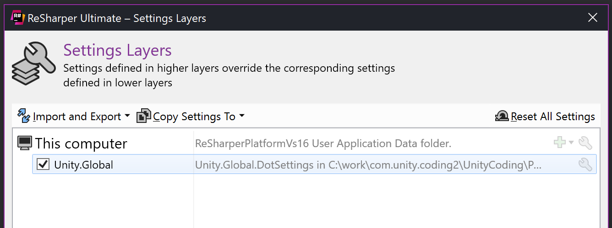
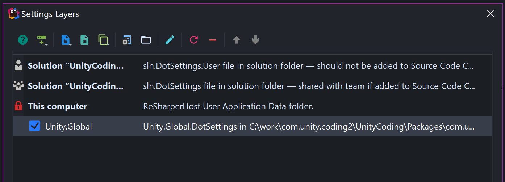

# About Unity's JetBrains Settings

We have standard Unity settings files that work in both ReSharper and Rider. Setup instructions are really similar.

Note that if you don't have ReSharper or Rider installed, you can get them via the [JetBrains Toolbox](https://www.jetbrains.com/toolbox/), and configure `https://jetbrains.hq.unity3d.com` as the license server (requires VPN).

## Configuring Visual Studio + ReSharper

* Open any version of Visual Studio (ReSharper settings are shared across all of them)
* Go to _ReSharper | Manage Options..._ (VS2019: find _ReSharper_ under the _Extensions_ menu)
* Click _Reset All Settings_ to nuke any local configuration you may have done (on purpose or accidental) which will override our standard settings
* Click the + on the right side of the "This computer" line
* Choose "Open Settings File..."
* Browse to and select `Unity.Global.DotSettings` in the same folder as this README.md file

The final dialog should look like this.

If your dialog has more things in it, like 'Personal' and 'Team-Shared', then it's because you have a solution open. No big deal.

## Configuring Rider

* Open Rider
* Open any solution (need to do this in order to get at layer managing)
* Open settings
  * On OSX, go to _JetBrains Rider | Preferences..._
  * On Windows, go to _File | Settings..._
* Click the _Manage Layers_ button on the lower left of the dialog
* Right-click on _This computer_, Select _Add layer_, then _Open Settings File_
* Browse to and select `Unity.Global.DotSettings` in the same folder as this README.md file

The final dialog should look like this:

