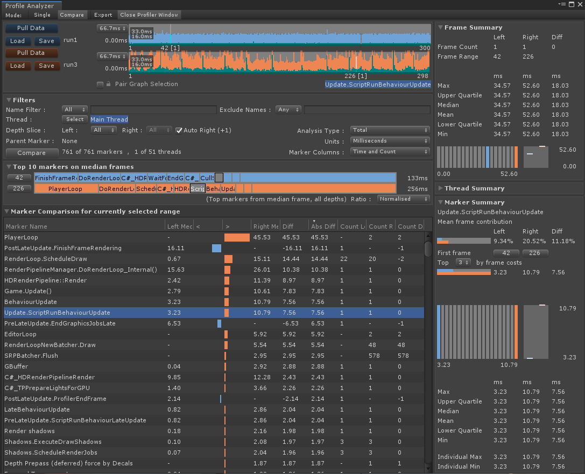

# Workflows
## Comparing Frames from Different Data Sets

This workflow will take you through the steps needed to compare two frames from different data sets, in this case the [median](https://en.wikipedia.org/wiki/Median) frames from each data set. Comparing the median frames is often useful to help reason about what could be happening in a frame that is central to the distribution for each data set. See [Ordering Frames by Length](ordering-frames-by-cost.md) for a workflow that helps extend the selected range and number of frames used from the middle of the frame distribution.

### 1. Collect performance data to analyze
1. Switch to the [Compare View](compare-view.md) using the _Compare_ button from the views toolbar.

2. Follow the instructions in the [collecting and viewing data](collecting-and-viewing-data.md) workflow except rather than pulling the data into the Single View, use the **upper** *Pull  Data* button in the compare view to populate the top (*left hand*) data set.

3. Follow the instructions in Step 2 except use the **lower** *Pull  Data* button in the compare view to populate the lower (*right hand*) data set.

### 2. Selecting the frames of interest
1. Ensure *Pair Graph Selection* is enabled.

2. In the upper [Frame Control](frame-range-selection.md), right click to access its context menu and select _Select Median Frame_.

After completing the above steps, the _Compare View_ will now analyze the two mean frames, the resulting UI will look something like this:

[Back to manual](manual.md)