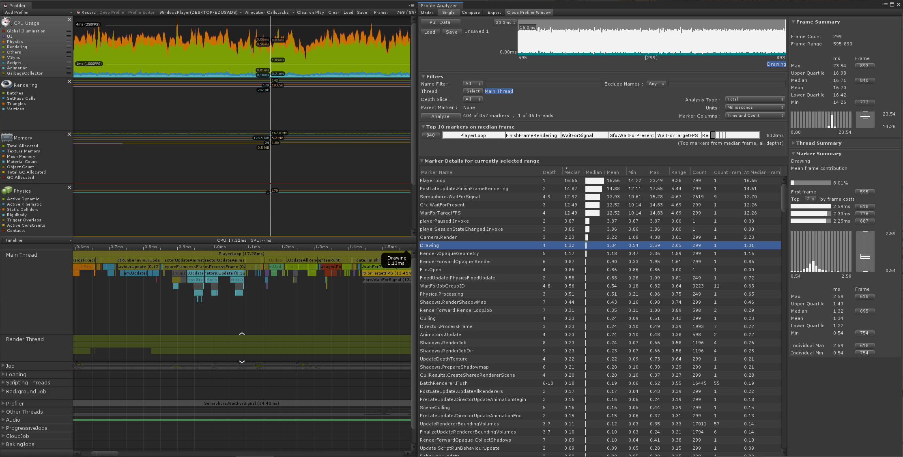

# Workflows
## Collecting and Viewing Data

This workflow will take you through the steps need to populate the Unity Profiler and Profile Analyzer with data.

### Opening the Unity Profiler Window
1. Open the Unity Profiler window via the main menu using _Window->Analysis->Profiler_ or using the _Ctrl+7_ keyboard shortcut, alternatively if you already have the Profile Analyzer window open you can use the _Open Profiler Window_ from the view's toolbar.

## Populating the Unity Profiler
The Profile Analyzer uses data collected from the [Unity Profiler](https://docs.unity3d.com/Manual/Profiler.html). We can populate the Unity Profiler with data in a number of ways, for instance we can make a  new capture or alternatively by loading a saved Unity Profiler capture file (.data) from a previous session.

### 1. Recording New Data
1. Select which player you would like to record data from using the dropdown on the Profiler Window toolbar, by default the profiler will be set to record from the _Editor_.

2. Press the _Record_ button located on the same toolbar to start recording data from your chosen player, a data window of frames will fill and wrap until you press the _Record_ button again.

### 2. Loading a Previous data set
1. Press _Load_  on the Profiler Window toolbar and navigate the file load dialog to a previously saved _.data_ file.

## Opening the Profile Analyzer Window and Pull the Recorded Data
1. Open the Profile Analyzer window via the main menu using _Window->Analysis->Profile Analyzer_.

2. Press the _Pull Data_ button on the Single View.

**Note:** The Profiler Window and Profile Analyzer Window both require a reasonable amount of screen real-estate so docking the 2 together into a single tabbed window can be advantageous as you will be moving between the two views frequently when reasoning about the data supplied.

[Back to manual](manual.md)