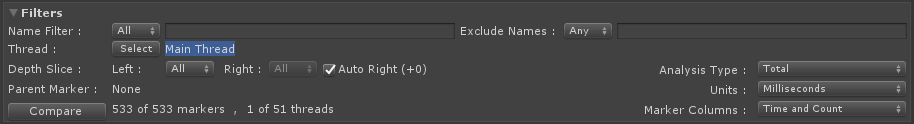
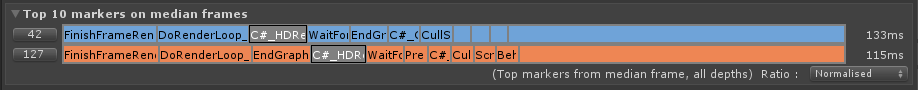

# Compare View

Building on the information shown in the [Single View](single-view.md), you can load two data sets, shown as two distinct colors with the difference between the two data sets visualised in an ordered table as well as seeing the distribution differences in the [histogram](https://en.wikipedia.org/wiki/Histogram) and [box and whisker plots](https://en.wikipedia.org/wiki/Box_plot).

The Compare View is populated from the data Single View, or from loaded .pdata files or from frames pulled from an active [Unity Profiler](https://docs.unity3d.com/Manual/Profiler.html) session and allows you to see how frames and markers are performing in comparison to each other.

The analysed data is broken into a number of panels, a [Frame Control](frame-range-selection.md) showing the individual frame times, a set of summary panels detailing min, max, [median](https://en.wikipedia.org/wiki/Median), [mean](https://en.wikipedia.org/wiki/Arithmetic_mean) and lower/upper [quartile](https://en.wikipedia.org/wiki/Interquartile_range) values for the frames, threads and markers. This data is also represented as a histogram and box and whisker plots.

## Frame Control

Displays the individual frame times ordered by frame index or by frame time for both sets of data. Use this control to select sub-ranges and have the analysis done over the newly selected frame set. See [Frame Range Selection](frame-range-selection.md) for detailed usage.

**Note:** To enable fair comparisons when comparing sub ranges it is very important to compare the same number of frames. Enabling _Paired Graph Selection_ will help you select the same number of frames, you can then optionally disable it to move the newly created selection around each graph independently.

## Filters

The Compare View’s working set can be reduced with the use of the [filtering system](filtering-system.md), limiting markers by partial name match, which thread they ran on and limiting to a specific stack level.

Along with filtering to a specific name match you can also elect to exclude a further set of markers by name to remove any markers that are not statistically relevant from the filter set or are somehow distorting the view of your filtered marker set.

The Compare View will automatically align the depth of the two data sets so that top level markers are aligned correctly but this can be overridden using the
Auto Right tick box and use of the Left and Right depth controls, this is especially useful when comparing data sets from different versions of Unity where the markers produced have changed.

## Median frame Top 10 Marker stack

Shows the top 10 contributing markers matching the current filter set and frame selection for both sets of data, changes to the depth filter will be reflected in this control. This control will enable you to see how the relative costs of markers differ proportionally to each other at the same marker depth.

You can choose how the Top 10 markers are drawn against each other, _Normalized_ is good for looking at the two data sets relative to their own time spent at the selected depth, _Longest_ is good for looking at the absolute difference between the two data sets at the selected depth.

## Frame Summary
Summarises the frame times for the min, median, max, lower quartile and upper quartile values. For some example data distributions see our [distributions](distributions.md) page.

## Thread Summary
Summarises the currently filtered thread median run time and shows a box-whisker plot that can be scaled by Median frame time, Upper quartile of frame time or Max frame time. 

## Marker Summary
Summarises the marker data of the currently selected item in the marker list and includes the mean frame contribution, Top ‘n’ frames by total frame cost and individual min and max values. Links are provided to allow simple navigation to the relevant frame in the Unity Profiler window. For some example data distributions see our [distributions](distributions.md) page.

## Marker list
A sortable list of markers showing a number of useful statistics, including the difference in the two sets, this is shown as a value and as a proportional graph colored and pointing towards left (blue) or right (orange), whichever is the larger value. Selecting a marker in the list drives the Marker Summary panel to show more in depth information.

 Each marker in the list represents an aggregation of all the instances of that marker, across all filtered threads and in all ranged frames.

The Marker list columns can be filtered to a more salient set from the _Marker Columns_ drop down in the [filtering system](filtering-system.md), which can help minimise the noise when you are looking for _Time_ or _Count_ values.

 ### Column and Groups Available:
* **Name**
    * Name of the marker - available in all groups

 * **Time and Count**
    * **Left Median**
        * The sum of activity for the marker in the upper (*left hand*) data set.
    * **Right Median**
        * The sum of activity for the marker in the lower (*right hand*) data set.
    * **Diff**
        * The difference between the summed values in each data set, negative values show the left is bigger, positive means the right is bigger.
    * **Abs Diff**
        * The absolute difference between the summed values in each data set.
    * **Count Left**
        * The number of times the marker is push / popped in the upper (*left hand*) data set.
    * **Count Right**
        * The number of times the marker is push / popped in the (*right hand*) data set.
    * **Count Delta**
        * The difference between the count values in each data set.

 * **Time**
    * **Left Median**
        * The sum of activity for the marker in the upper (*left hand*) data set.
    * **Right Median**
        * The sum of activity for the marker in the lower (*right hand*) data set.
    * **Diff**
        * The difference between the summed values in each data set, negative values show the left is bigger, positive means the right is bigger.
    * **Abs Diff**
        * The absolute difference between the summed values in each data set.

 * **Totals**
    * **Total Left**
        * The total time for the marker over the selected frames in the upper (*left hand*) data set.
    * **Total Right**
        * The total time for the marker over the selected frames in the lower (*right hand*) data set.
    * **Total Delta**
        * The difference between the total times over the selected frames in each data set, negative values show the left is bigger, positive means the right is bigger.
    * **Abs Total**
        * The absolute difference between the total times over all the selected frames in each data set.
 
 * **Time with Totals**
    * **Left Median**
        * The sum of activity for the marker in upper (*left hand*) data set.
    * **Right Median**
        * The sum of activity for the marker in lower (*right hand*) data set.
    * **Abs Diff**
        * The absolute difference between the summed values in each data set.
    * **Total Left**
        * The total time for the marker over the selected frames in the upper (*left hand*) data set.
    * **Total Right**
        * The total time for the marker over the selected frames in the lower (*right hand*) data set.
    * **Abs Total**
        * The absolute difference between the total times over the selected frames in each data set.

 * **Count Totals**
    * **Count Left**
        * The number of times the marker is push / popped in the selected frames in upper (*left hand*) data set.
    * **Count Right**
        * The number of times the marker is push / popped in the selected frames in lower (*right hand*) data set.
    * **Count Delta**
        * The difference between the number of times the marker is push / popped in the selected frames for each data set, negative values show the left is bigger, positive means the right is bigger.
    * **Abs Count**
        *  The difference between the number of times the marker is push / popped in the selected frames for each data set, negative values show the left is bigger, positive means the right is bigger.

 * **Count Per Frame**
    * **Count Left Frame**
        * The number of times the marker is push / popped in the upper (*left hand*) data set.
    * **Count Right Frame**
        * The number of times the marker is push / popped in the lower (*right hand*) data set.
    * **Abs Frame Count**
        * The absolute difference between the number of times the marker is push / popped in each data set.

 * **Custom**
    * From any of the Marker Column Groups you can turn on / off any of the available columns to create a custom set of columns.

### Marker List Context Menu Commands
* **Select Frames that contain this marker (within whole data set)**
    * Select all the frames from the entire time range that contain an instance of this marker.

* **Select Frames that contain this marker (within current selection)**
    * Reduce the current range selection to only include frames that contain an instance of this marker.

* **Clear Selection**
    * Clear any range selection.

* **Add to Include Filter**
    * Add the currently selected marker to the *include* filter, this will filter the marker list to only markers that match.

* **Add to Exclude Filter**
    * Add the currently selected marker to the *exclude* filter, this will remove the marker from the marker list, useful to remove markers that are costly but are dwarfing markers that you are interested in.

* **Remove from Include Filter**
    * If the selected marker is already in the *include* filter then this command will remove it from the filter, resulting in more markers becoming visible again.

* **Remove from Exclude Filter**
    * If the selected marker is already in the *exclude* filter then this command will remove from the filter.

* **Set as Parent Marker Filter**
    * Limit the analysis to this marker and markers *included* below it on the callstack.

* **Clear Parent Marker Filter**
    * Limit the analysis to this marker and markers *included* within it.

* **Copy To Clipboard**
    * Copies the selected marker name to the clipboard.

[Back to manual](manual.md)