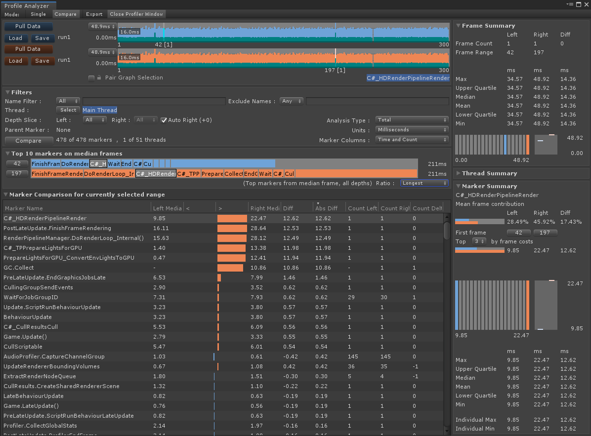

# Workflows
## Comparing Frames from the Same Data Set

This workflow will take you through the steps needed to compare two frames from the same data set, in this case the [median](https://en.wikipedia.org/wiki/Median) and longest frames. Comparing the median and longest frames is often useful to help reason about what could be happening in the longest frame that is not happening in an average frame, or what is taking longer than average to complete.

### 1. Collect performance data to analyze
1. Follow the instructions in the [collecting and viewing data](collecting-and-viewing-data.md) workflow.

2. Switch to the [Compare View](compare-view.md) using the _Compare_ button from the views toolbar.

### 2. Selecting the frames of interest
1. In the upper [Frame Control](frame-range-selection.md), right click to access its context menu and select _Select Median Frame_.

2. In the lower Frame Control, right click to access its context menu and select _Select longest Frame_.

After completing the above steps, the _Compare View_ will now analyze the two frames and show you the data for just the median and longest frames, the resulting UI will look something like this:

[Back to manual](manual.md)