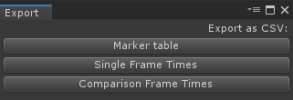

# Export

The analyzed frame data can be exported to a [csv](https://en.wikipedia.org/wiki/Comma-separated_values) file in several formats:
* **Marker table.**
    * Exports the marker data visible in the [Single View](single-view.md).
* **Single Frame times.**
    * Exports the frame data visible in the [Single View](single-view.md).
* **Comparison Frame times.**
    * Exports both sets of frame data visible in the [Compare View](compare-view.md).
    
[Back to manual](manual.md)