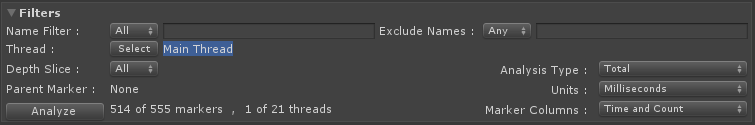

# Filtering System

The [Single](single-view.md) and [Compare](compare-view.md) View's working set can be reduced with the use of the frame range and filter system.

## Filtering
The filtering system allows you to limit the visible markers by partial name match, specific threads they ran on and to a specific stack level.

Along with filtering to a specific name _match_ you can also elect to _exclude_ a further set of markers by name to remove any markers that are not statistically relevant from the filter set or are somehow distorting the view of markers you currently have filtered.

### Marker Name Filtering
Marker names with spaces can be used in the include and exclude filters by simply wrapping them in quotes *e.g., "Render Path"*.

The *Any* and *All* options on the include and exclude marker name filters allow you to specify whether the name match is for *Any* of the values listed or in the case of *All* has to match all of the listed values to be a match.

Markers can be added to either the include or exclude filter by right clicking the marker in the marker list of the Single or Compare views and selecting the *Add to Include Filter* or the *Add to Exclude Filter*.

To remove a marker filter simply right click the marker in the marker list of the Single or Compare views and select the *Remove from Include Filter* or *Remove from Exclude Filter*.

### Analysis Type
* **Total**
    * Marker times will be *inclusive*, meaning they include time spent in the marker and its children.
* **Self**
    * Marker times will be *exclusive*, meaning they exclude time spent in the markers children.

### Units
The unit of measurement used to display time used throughout the Profile Analyzer can be switched from [Milliseconds](https://en.wikipedia.org/wiki/Millisecond) and [Microseconds](https://en.wikipedia.org/wiki/Microsecond).

### Marker Columns
The Marker list columns can be filtered to a more salient set which can help minimise the noise when you are looking for _Time_ or _Count_ values.

## Single View

## Compare View

The Compare View will automatically align the depth of the two data sets so that top level markers are aligned correctly but this can be overridden using the
Auto Right tick box and use of the Left and Right depth controls, this is especially useful when comparing data sets from different versions of Unity where the markers produced have changed.

[Back to manual](manual.md)