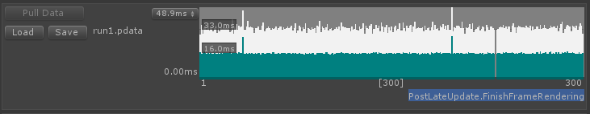
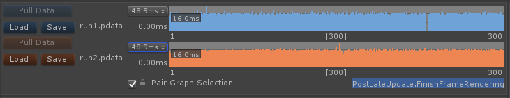

# Frame Control and Range Selection

The [Single](single-view.md) and [Compare](compare-view.md) View's working set of frames can be reduced by making a range in the Frame Control

## Frame Control
### Single View

### Compare View

* Use the _Pair Graph Selection_ to enable range selections, range moving and other graph commands to be reflected in both graphs.

The y-axis of the Frame Control is adjusted by the drop down on the left edge of the graph, you can choose the maximum value from the data set or one of the traditional frame boundaries supplied (16.67ms or 60Hz, 33.33ms or 30Hz, 66.67ms or 15Hz)

**Note:** To get the best out of range comparisons it is very important to compare the same number of frames or range length, if this is not the case then you will get a natural bias towards the time spent in the larger set. Enabling _Paired Graph Selection_ will help you select the same number of frames, you can then optionally disable it to move the newly created selection around each graph independently.

## Selecting a Frame Range
The Profile Analyzer uses all the frames in the currently open set unless you select a sub-range. Selecting a sub-range limits the analysis to just those frames allowing you to focus in on a specific frame or set of frames that look to be exhibiting an interesting behaviour. To help visualize which frames are in the current selection the [_start frame_], [_frame count_] and [_end frame_] numbers will appear on the x-axis of the frame graph.

**Note:** The following commands are only paired to both _Frame Controls_ when the _Pair Graph Selection_ option is ticked.

### Range Controls
* **Making a Range in the Frame Control**
    * Left Mouse Button Down -> Drag -> Left Mouse Button Up.

* **Moving the Selected Range in the Frame Control.**
    * In the currently selected range press SHIFT + Left Mouse Button Down -> Drag -> Left Mouse Button Up.

* **Growing the Selected Range in the Frame Control.**
    * In the currently selected range press the '+' key to extend both the start and stop frames by one. 

* **Extending the Start of the Selected Range in the Frame Control.**
    * In the currently selected range press the '<' key to extend the selection by including the frame to the left of the current start position.

* **Extending the End of the Selected Range in the Frame Control.**
    * In the currently selected range press the '>' key to extend the selection by including the frame to the right of the current end position.

* **Shrinking the Selected Range in the Frame Control.**
    * In the currently selected range press the '-' key to reduce both the start and stop frames by one. 

**Note:** Holding down SHIFT will speed up the operations listed above. Holding down ALT will invert the operation, for example making an *extend range start frame* into a *reduce frame start frame* operation.

### Range Control Context Menu Commands

Right Click in the Frame Control to bring up the context menu for the following controls.

* **Clear Selection**
    * Clears the selected range. The analysis will then be performed on the whole data set.

* **Invert Selection**
    * Inverts the selected range.

* **Select Shortest Frame**
    * Selects the frame with the shortest time.

* **Select Longest Frame**
    * Selects the frame with the longest time.

* **Select Median Frame**
    * Selects the frame with the [Median](https://en.wikipedia.org/wiki/Median) time. 

* **Zoom Selection**
    * Zooms the frame time graph display to show just the selected range.

* **Zoom All**
    * Zoom out to show all Frames. The current selection range will be highlighted.

### Frame Control Context Menu Commands
* **Show Selected Marker**
    * Toggle whether or not you would like to see the currently selected markers time for each frame overlaid on the graph.

* **Show Filtered Threads**
    * Toggle whether or not you would like to see the currently filtered thread times for each frame overlaid on the graph.

* **Show Frame Lines**
    * Toggle whether or not you would like to see the common frame boundaries as a horizontal line on the graph.

* **Order By Frame Duration**
    * Toggle the order of the frames on the horizontal axis from Frame Index (0, 1, 2, 3) to Frame start time (16.67, 16.69) - useful for grouping similarly performant frames together.

**Note:** The above commands are always paired to both Frame Controls

[Back to manual](manual.md)