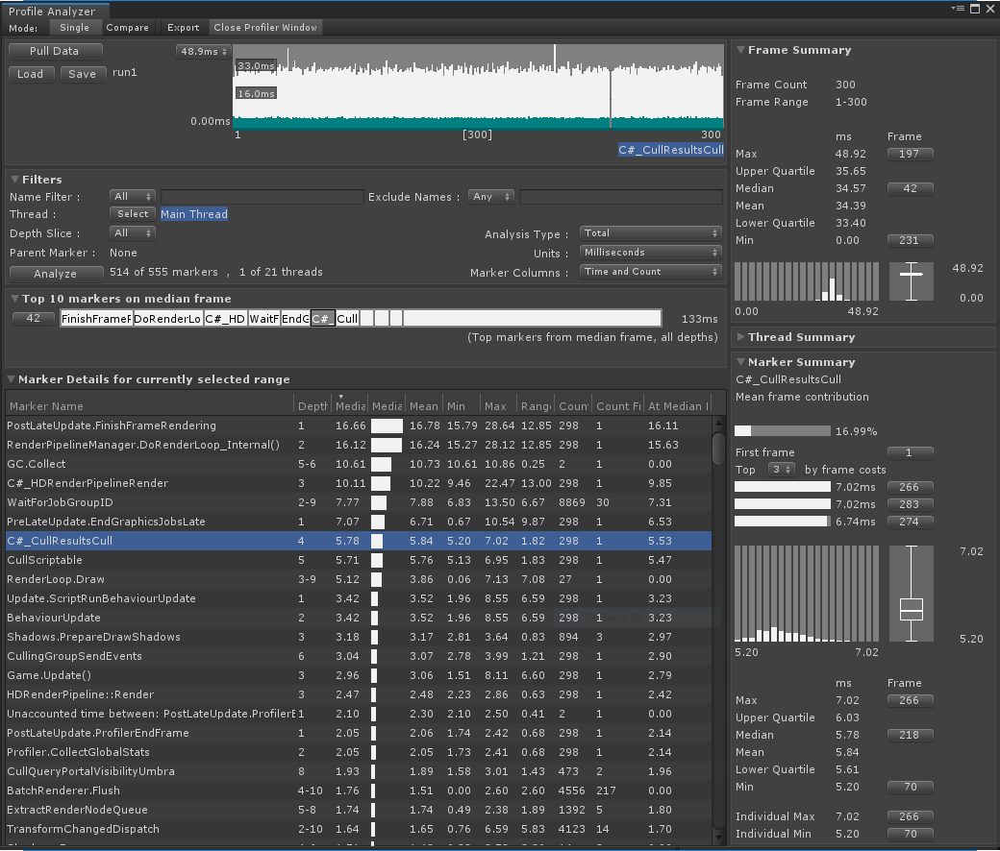

# About Profile Analyzer
The Profile Analyzer aggregates and visualises frame and marker data from a set of [Unity Profiler](https://docs.unity3d.com/Manual/Profiler.html) frames to help you reason about their behaviour over a number of frames, complementing the single frame analysis already available in the Unity Profiler.

# Installing Profile Analyzer
## Unity Versions with Package Manager Support
To install this package into versions of Unity that support the package manager follow the instructions in the [Package Manager documentation](https://docs.unity3d.com/Packages/com.unity.package-manager-ui@latest/index.html). 

## Earlier Versions of Unity
For earlier versions follow this link to the Profile Analyzer [download](https://unity.bintray.com/unity/com.unity.performance.profile-analyzer/-/) and place the contents into your project assets folder.

# Using Profile Analyzer
To learn how to use the Profile Analyzer package in your project, read the [manual](manual.md).

# Technical details
## Requirements
This version of Profile Analyzer is compatible with the following versions of the Unity Editor:

* 5.6 and later

# Known-limitations
Profile Analyzer includes the following known limitations:

* The original profile data is not saved in the profile analyzer .pdata file. Therefore its recommended to store both the Unity Profiler .data file (or .raw file exported from a stand alone player) alongside the .pdata file.

* Clicking on a marker attempts to jump to the marker in the Unity Profiler if the same data is loaded. A selection must have previously been made in the Unity Profiler for this to work. The vertical height is not correct in the UI view in the Unity profiler.

## Document revision history
|Date|Reason|
|---|---|
|April 1, 2019|Removed old out of date PDF file as this documentation supersedes it. Updated tips section|
|March 31, 2019|Document updated to match package version 0.2.0.preview|
|Dec 7, 2018|Document created. Matches package version 0.1.0.preview|

