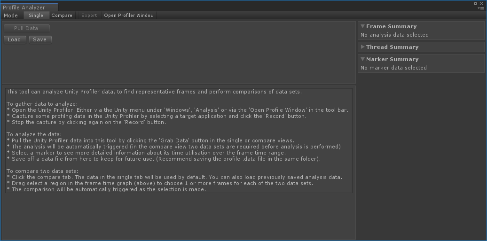

# Profile Analyzer Window

The Profile Analyzer Window contains two views, the [Single](single-view.md) and [Compare](compare-view.md) views, both of these views visualise frame, thread and marker data from the [Unity Profiler]() window and show min, max, [median](https://en.wikipedia.org/wiki/Median), [mean](https://en.wikipedia.org/wiki/Arithmetic_mean) and lower/upper [quartile](https://en.wikipedia.org/wiki/Interquartile_range) values over the selected frame range including the distribution of each marker using [histogram](https://en.wikipedia.org/wiki/Histogram) and [box and whisker plots](https://en.wikipedia.org/wiki/Box_plot).

## Performance Data
The data analysed is CPU data and comes from the active set of frames currently loaded in the Unity Profiler or loaded from a previously saved Profile Analyzer .pdata file. If the data sets loaded into the Profile Analyzer and Unity Profiler contents match then you can jump to frames of interest in the Unity Profiler using frame links in the Profile Analyzer UI.

### Pulling Performance Data
Pulling CPU from an active profile session is simply a case of pressing the _Pull Data_ button in Single Mode, this will pull the current set of available frames from the Unity Profiler and visualises the analysed results in the Single View, this will also populate any empty data set slots in the Compare View, this enables you compare different frames from the same data set.

If you don’t have an active profile session you can press the _Open Profiler Window:_ button, then load or record some frame data.

The Profile Analyzer aggregates activity of each marker, generating useful statistics to help you reason about the marker costs over a number of threads and frames. This includes, for each names marker, summing the runtime / counts of each occurrence for all active threads and frames captured.

### Load/Save a Data Set
Any data analysed can be saved and reloaded at any point in time, this allows you to share your analysis with others and to load the results into the Single or Compare View for deeper introspection at any time.

### Frame Range Selection
You can limit the analysis to a subset of frames by making a range in the [Frame Control](frame-range-selection.md) at the top of the Single and Compare views.

### Filtering
Various [filtering](filtering-system.md) options are available on the data to limit the markers displayed, this includes by thread, call depth and name substrings. The remaining markers can be ordered by any of the available metrics in the marker list control.

## Single View
The Single View Visualises frame and marker data from the Unity Profiler window and shows each marker’s min, max, median, mean and lower/upper quartile values over the selected frame range including the distribution of each marker visualized using histogram and box and whisker plots.

## Compare View
The Compare View builds on the information shown in the Single View, you can load two data sets, shown as two distinct colors with the difference between the two data sets visualised in an ordered table as well as seeing the distribution differences in the histogram and box and whisker plots.

[Back to manual](manual.md)

