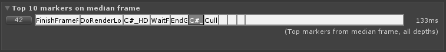

# Single View

The single view is populated from a loaded .pdata file or from frames pulled from an active [Unity Profiler](https://docs.unity3d.com/Manual/Profiler.html) session and allows you to see how markers are performing across the selected frames.

The analysed data is broken into a number of panels, a [Frame Control](frame-range-selection.md) showing the individual frame times, a set of summary panels detailing min, max, [median](https://en.wikipedia.org/wiki/Median), [mean](https://en.wikipedia.org/wiki/Arithmetic_mean) and lower/upper [quartile](https://en.wikipedia.org/wiki/Interquartile_range) values for the frames, threads and markers. This data is also represented as a [histogram](https://en.wikipedia.org/wiki/Histogram) and [box and whisker plots](https://en.wikipedia.org/wiki/Box_plot).

## Frame Control

Displays the individual frame times ordered by frame index or by frame time. Use this control to select sub-ranges and have the analysis done over the newly selected frame set. See [Frame Range Selection](frame-range-selection.md) for detailed usage.

## Filters

The Single View’s working set can be reduced with the use of the [filtering system](filtering-system.md), limiting markers by partial name match, which thread they ran on and limiting to a specific stack level.

Along with filtering to a specific name match you can also elect to exclude a further set of markers by name to remove any markers that are not statistically relevant from the filter set or are somehow distorting the view of your filtered marker set.

## Median Frame Top 10 Marker stack

Shows the top 10 contributing markers matching the current filter set and frame selection, changes to the depth filter will be reflected in this control.

## Frame Summary
Summarises the frame times with links to relevant frames in the profiler window for the min, median and max frames. This data is also represented as a histogram and box and whisker plot. For some example data distributions see our [distributions](distributions.md) page.

## Thread Summary
Summarises the currently filtered thread median run time and shows a box and whisker plot that can be scaled by Median frame time, Upper quartile of frame time or Max frame time.

## Marker Summary
Summarises the marker data of the currently selected item in the marker list and includes the mean frame contribution, Top ‘n’ frames by total frame cost and individual min and max values. Links are provided to allow simple navigation to the relevant frame in the Unity Profiler window. This data is also represented as a histogram and box and whisker plot. For some example data distributions see our [distributions](distributions.md) page.

## Marker list
A sortable list of markers showing a number of useful statistics, selecting a marker in the list drives the Marker Summary panel to show more in depth information. Each marker in the list represents an aggregation of all the instances of that marker, across all filtered threads and in all ranged frames.

The Marker list columns can be filtered to a more salient set from the _Marker Columns_ drop down in the [filtering system](filtering-system.md), which can help minimise the noise when you are looking for _Time_ or _Count_ values.

 ### Column and Groups Available:
* **Name**
    * Name of the marker - available in all groups

* **1st**
    * The frame number that the marker was first pushed / popped. - not on by default in any groups

* **Time and Count**
    * **Depth**
        * The depths in the hierarchy that the marker appears on.
    * **Median**
        * The median value from the markers time distribution.
    * **Mean**
        * The average value from the markers time distribution.
    * **Min**
        * The minimum value from the markers time distribution.
    * **Max**
        * The maximum value from the markers time distribution.
    * **Range**
        * The difference from the maximum and minimum marker times.
    * **Count**
        * The number of times the marker was push / popped.
    * **Count Frame**
        * The average number of times the marker was pushed / popped per frame.
    * **At Median Frame**
        * The sum of activity for the marker in the median frame.

* **Time**
    * **Depth**
        * The depths in the hierarchy that the marker appears on.
    * **Median**
        * The median value from the markers time distribution.
    * **Min**
        * The minimum value from the markers time distribution.
    * **Max**
        * The maximum value from the markers time distribution.
    * **Range**
        * The difference from the maximum and minimum marker times.
    * **At Median Frame**
        * The sum of activity for the marker in the median frame.

* **Totals**
    * **Depth**
        * The depths in the hierarchy that the marker appears on.
    * **Total**
        * The total time spent for this marker in all the selected frames.

* **Time With Totals**
    * **Depth**
        * The depths in the hierarchy that the marker appears on.
    * **Median**
        * The median value from the markers time distribution.
    * **Min**
        * The minimum value from the markers time distribution.
    * **Max**
        * The maximum value from the markers time distribution.
    * **Range**
        * The difference from the maximum and minimum marker times.
    * **At Median Frame**
        * The sum of activity for the marker in the median frame.
    * **Total**
        * The total time spent for this marker in all the selected frames.

* **Count Total**
    * **Depth**
        * The depths in the hierarchy that the marker appears on.
    * **Count**
        * The number of times the marker was push / popped.

* **Count Per Frame**
    * **Depth**
        * The depths in the hierarchy that the marker appears on.
    * **Count Frame**
        * The average number of times the marker was pushed / popped per frame.

 * **Custom**
    * From any of the Marker Column Groups you can turn on / off any of the available columns to create a custom set of columns.

### Marker List Context Menu Commands
* **Select Frames that contain this marker (within whole data set)**
    * Select all the frames from the entire time range that contain an instance of this marker.

* **Select Frames that contain this marker (within current selection)**
    * Reduce the current range selection to only include frames that contain an instance of this marker.

* **Clear Selection**
    * Clear any range selection.

* **Add to Include Filter**
    * Add the currently selected marker to the *include* filter, this will filter the marker list to only markers that match.

* **Add to Exclude Filter**
    * Add the currently selected marker to the *exclude* filter, this will remove the marker from the marker list, useful to remove markers that are costly but are dwarfing markers that you are interested in.

* **Remove from Include Filter**
    * If the selected marker is already in the *include* filter then this command will remove it from the filter, resulting in more markers becoming visible again.

* **Remove from Exclude Filter**
    * If the selected marker is already in the *exclude* filter then this command will remove from the filter.

* **Set as Parent Marker Filter**
    * Limit the analysis to this marker and markers *included* below it on the callstack.

* **Clear Parent Marker Filter**
    * Limit the analysis to this marker and markers *included* within it.

* **Copy To Clipboard**
    * Copies the selected marker name to the clipboard.

[Back to manual](manual.md)