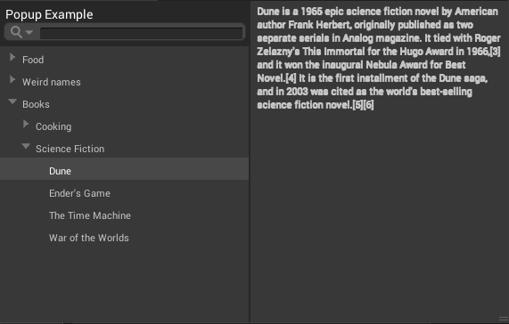
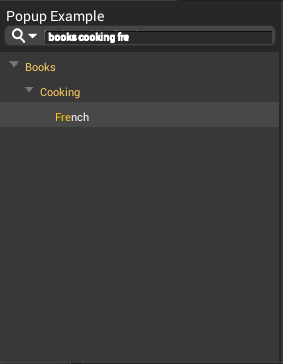

# Searcher

## Disclaimer

Currently, the API for the **Searcher** is not intended for public use. Using the API in external custom scripts or modifying the API is not recommended or supported at this time. 

 

The **Searcher** package adds a powerful search window to Unity's Graph View tools which lets you quickly find, select, and place items into the graph window. 

## Features 

The **Searcher** window uses a tree view to display the available options and the categories they belong to. As you type, the Searcher makes predictions and provides auto-complete options for the item you might be trying to select. The Searcher also highlights the matching text in the tree view to help you quickly find what you're looking for. Some instances of the **Searcher** also provide inline documentation or notes in an extra window to the right of the item tree. 

## Navigating the Searcher

You can navigate through the **Searcher** with either your mouse or keyboard. Use your mouse to scroll through tree menu items. To expand or collapse tree menu items click on them, and double-click the item to make your selection. To navigate up and down the list of items with your keyboard, press the Up arrow key or Down arrow key. To expand tree menus, press the Right arrow key, and press the Left arrow key to collapse the tree menus. To make a selection of the highlighted item, press the Enter key.  
