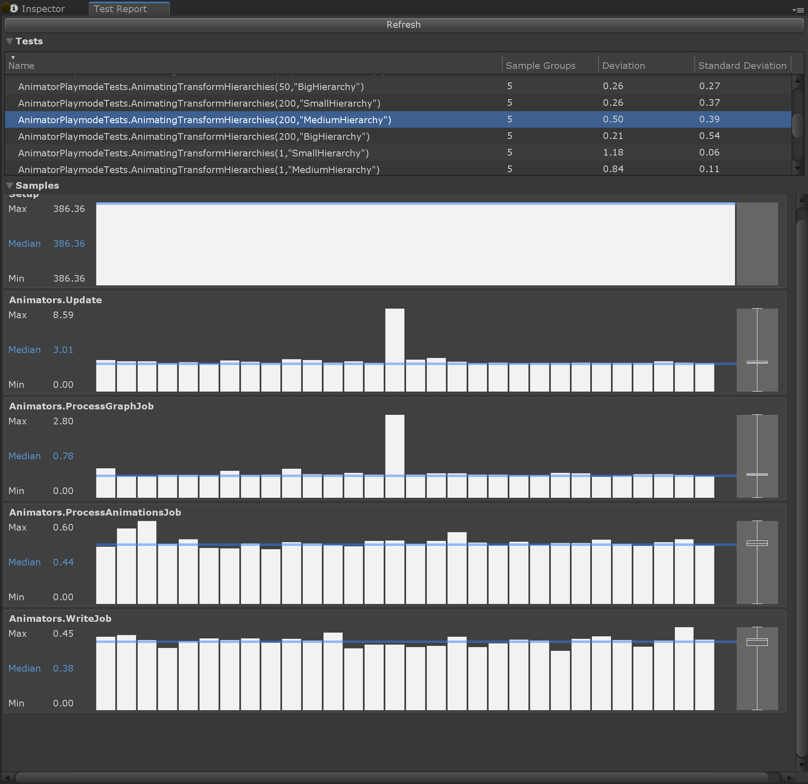

# Performance Testing Extension for Unity Test Runner

The Unity Performance Testing Extension is a Unity Editor package that, when installed, provides an API and test case decorators to make it easier to take measurements/samples of Unity profiler markers, and other custom metrics outside of the profiler, within the Unity Editor and built players. It also collects configuration metadata, such as build and player settings, which is useful when comparing data against different hardware and configurations.

The Performance Testing Extension is intended to be used with, and complement, the Unity Test Runner framework. For more information on how to create and run tests please refer to [Unity Test Runner documentation](https://docs.unity3d.com/Manual/testing-editortestsrunner.html).


**Important Note:** When tests are run with the Unity Test Runner, a development player is always built to support communication between the editor and player, effectively overriding the development build setting from the build settings UI or scripting API.

## Installing

To install the Performance Testing Extension package
1. Open the `manifest.json` file for your Unity project (located in the YourProject/Packages directory) in a text editor
2. Add `"com.unity.test-framework.performance": "1.2.3-preview",` to the dependencies
3. Save the manifest.json file
4. Verify the Performance Testing Extension is now installed opening the Unity Package Manager window

To access performance testing apis add `Unity.PerformanceTesting` to your assembly definition references section.


## Test Attributes
**[Performance]** - Use this with  `Test` and `UnityTest` attributes. It will initialize necessary test setup for performance tests.

**[Test]** -  Non-yielding test. This type of test starts and ends within the same frame.

**[UnityTest]** - Yielding test. This is a good choice if you want to sample measurements across multiple frames.

**[Version(string version)]** - Performance tests should be versioned with every change. If not specified it will be assumed to be 1. This is essential when comparing results as we results will vary anytime the test changes.


## SampleGroupDefinition

**struct SampleGroupDefinition** - used to define how a measurement is used in reporting and in regression detection.

Optional parameters
- **name** : Name of the measurement. If unspecified a default name of "Time" will be used.
- **sampleUnit** : Unit of the measurement to report samples in. Possible values are:
Nanosecond, Microsecond, Millisecond, Second, Byte, Kilobyte, Megabyte, Gigabyte
- **aggregationType** : Preferred aggregation (default is median). Possible values are:
Median, Average, Min, Max, Percentile
- **percentile** : If aggregationType is Percentile, the percentile value used for the aggregation. e.g. 0.95.
- **increaseIsBetter** : Determines whether or not an increase in the measurement value should be considered a progression (performance improved) or a performance regression. Default is false. **NOTE:** This value is not used directly in the Performance Testing Extension, but recorded for later use in a reporting tool (such as the [Unity Performance Benchmark Reporter](https://github.com/Unity-Technologies/PerformanceBenchmarkReporter/wiki)) to determine whether or not a performance regression has occurred when used with a baseline result set.
- **threshold** : The threshold, as a percentage of the aggregated sample group value, to use for regression detection. Default value is 0.15f. **NOTE:** This value is not used directly in the Performance Testing Extension, but recorded for later use in a reporting tool (such as the [Unity Performance Benchmark Reporter](https://github.com/Unity-Technologies/PerformanceBenchmarkReporter/wiki)) to determine whether or not a performance regression has occurred when used with a baseline result set.


## Taking measurements

The Performance Testing Extension provides several API methods you can use to take measurements in your performance test, depending on what you need to measure and how you want to do it. In order to use this you have to include `using Unity.PerformanceTesting` at the top of your script.

They are:
* Measure.Method
* Measure.Frames
* Measure.Scope(SampleGroupdDefinition sampleGroupDefinition)
* Measure.FrameTimes(SampleGroupdDefinition sampleGroupDefinition)
* Measure.ProfilerMarkers(SampleGroupDefinition[] sampleGroupDefinitions)
* Measure.Custom(SampleGroupDefinition sampleGroupDefinition, double value)

The sections below detail the specifics of each measurement method with examples.


### Measure.Method()

This will execute the provided method, sampling performance using the following additional properties/methods to control how the measurements are taken:
* **WarmupCount(int n)** - number of times to to execute before measurements are collected. If unspecified, a default warmup is executed. This default warmup will wait for 7 ms. However, if less than 3 method executions have finished in that time, the warmup will wait until 3 method executions have completed.
* **MeasurementCount(int n)** - number of measurements to capture. Default is 7 if not specified.
* **IterationsPerMeasurement(int n)** - number of method executions per measurement to use. If this value is not specified, the method will be executed as many times as possible until approximately 1 ms has elapsed.
* **GC()** - if specified, will measure the total number of Garbage Collection allocation calls.

#### Example 1: Simple method measurement using default values

``` csharp
[Test, Performance]
public void Test()
{
    Measure.Method(() => { ... }).Run();
}
```

#### Example 2: Customize Measure.Method properties

```
[Test, Performance]
public void Test()
{
    Measure.Method(() => { ... })
        .WarmupCount(10)
        .MeasurementCount(10)
        .IterationsPerMeasurement(5)
        .GC()
        .Run();
}
```

### Measure.Frames()

Records time per frame by default and provides additional properties/methods to control how the measurements are taken:
* **WarmupCount(int n)** - number of times to to execute before measurements are collected. If unspecified, a default warmup is executed. This default warmup will wait for 80 ms. However, if less than 3 full frames have rendered in that time, the warmup will wait until 3 full frames have been rendered.
* **MeasurementCount(int n)** - number of frames to capture measurements. If this value is not specified, frames will be captured as many times as possible until approximately 500 ms has elapsed.
* **DontRecordFrametime()** - disables frametime measurement.
* **ProfilerMarkers(...)** - sample profile markers per frame. Does not work for deep profiling and `Profiler.BeginSample()`
* **Scope()** - measures frame times in a given coroutine scope.


#### Example 1: Simple frame time measurement using default values of at least 7 frames and default WarmupCount (see description above).

``` csharp
[UnityTest, Performance]
public IEnumerator Test()
{
    ...

    yield return Measure.Frames().Run();
}
```

#### Example 2: Sample profile markers per frame, disable frametime measurement

If you’d like to sample profiler markers across multiple frames, and don’t have a need to record frametime, it is possible to disable the frame time measurement.

``` csharp
[UnityTest, Performance]
public IEnumerator Test()
{
    ...

    yield return Measure.Frames()
        .ProfilerMarkers(...)
        .DontRecordFrametime()
        .Run();
}
```

#### Example 3: Sample frame times in a scope

``` csharp
[UnityTest, Performance]
public IEnumerator Test()
{
    using (Measure.Frames().Scope())
    {
        yield return ...;
    }
}
```

#### Example 3: Specify custom WarmupCount and MeasurementCount per frame

If you want more control, you can specify how many frames you want to measure.

``` csharp
[UnityTest, Performance]
public IEnumerator Test()
{
    ...

    yield return Measure.Frames()
        .WarmupCount(5)
        .MeasurementCount(10)
        .Run();
}
```

### Measure.Scope()

Measures execution time for the scope as a single time, for both synchronous and coroutine methods.

#### Example 1: Measuring a scope; execution time is measured for everything in the using statement

``` csharp
[Test, Performance]
public void Test()
{
    using(Measure.Scope())
    {
        ...
    }
}
```


### Measure.ProfilerMarkers()

Used to record profiler markers. Profiler marker timings will be pciked up automatically and sampled within the scope of the `using` statement. Name of the `SampleGroupDefinition` should match profiler marker name. Note that deep and editor profiling are not available. Profiler markers created using `Profiler.BeginSample()` are not supported, switch to `ProfilerMarker` if possible. 

#### Example 1: Measuring profiler markers in a scope

``` csharp
[Test, Performance]
public void Test()
{
    SampleGroupDefinition[] m_definitions =
    {
        new SampleGroupDefinition("Instantiate"),
        new SampleGroupDefinition("Instantiate.Copy"),
        new SampleGroupDefinition("Instantiate.Produce"),
        new SampleGroupDefinition("Instantiate.Awake")
    };

    using(Measure.ProfilerMarkers(m_definitions))
    {
        ...
    }
}
```


### Measure.Custom()

When you want to record samples outside of frame time, method time, or profiler markers, use a custom measurement. It can be any double value. A sample group definition is required.

#### Example 1: Use a custom measurement to capture total allocated memory

``` csharp
[Test, Performance]
public void Test()
{
    var definition = new SampleGroupDefinition("TotalAllocatedMemory", SampleUnit.Megabyte);
    Measure.Custom(definition, Profiler.GetTotalAllocatedMemoryLong() / 1048576f);
}
```

## Output

When a test is selected in the Unity Test Runner window within the Unity Editor, each performance test will have a performance test summary. This summary includes every sample group’s aggregated samples such as median, min, max, average, standard deviation, sample count, count of zero samples and sum of all samples.

#### Example 1: Performance Test Summary from Unity Test Runner window

`Time Millisecond Median:53.59 Min:53.36 Max:62.10 Avg:54.07 Std:1.90 Zeroes:0 SampleCount: 19 Sum: 1027.34`


## Viewing performance test report

The Performance Test Report window shows a detailed breakdown of individual test runs. This can be used to assess the stability of each test. It provides a visualisation of each individual sample recorded within a sample group along with summary statistics for the selected test. You can open the window by going to *Window > Analysis > Performance Test Report*.

The Performance Test Report is split into two views: the *test view* and the *sample group view*.

**Test View:** Provides a list of all tests. Each of the columns can be clicked to sort the view. Column values show the sample group with highest deviation.

* *Name* - name of the test.
* *Deviation* - The deviation is a value calculated by dividing the standard deviation by the median for a sample group. It shows the sample group with the highest 'deviation' value. Useful for defining stability of the test.
* *Standard Deviation* - Standard deviation of the samples in a sample group. It shows the sample group with the highest standard deviation.

**Sample Group View:** Visualizes sample groups for selected test in the Test View. Provides
*   Sample group summary  displaying the min, max, and median values for a given sample group.
*   Samples displayed in a bar chart, ordered by time, with a blue line indicating the median.
*   Box plot showing upper (75%) and lower (25%) quartiles, min, max and median of the samples for a given sample group.

*Note: Performance Test Report is supported in Unity version 2018.3 or newer.*



## Unity alpha version compatibility

Unity alpha releases include a lot of changes and some of them can lead to breaking compatible with the Performance Testing Extension. We cannot currently make the package work with each version of Unity alpha releases, therefore we will provide details on which version of the package is compatible in case of a breaking change.

| Unity version             | Package version |
| ------------------------- | --------------- |
| 2019.2.0a10 - latest      | 1.2.3-preview   |
| 2019.2.0a1 - 2019.2.0a10  | 1.0.9-preview   |
| 2019.1.0a10 - 2019.2.0a1  | 0.1.50-preview  |
| 2019.1.0a01 - 2019.1.0a10 | 0.1.42-preview  |
| Older versions            | 0.1.50-preview  |

## Tips

### Project settings

- Remove all QualitySettings but one under project settings. Otherwise you may have different configurations when running on different platforms. If you require different settings per platform then make sure they are being set as expected.
- Disable VSync under QualitySettings. Some platforms like Android have a forced VSync and this will not be possible.
- Disable HW Reporting `PlayerSettings -> Other -> Disable HW Reporting`
- Remove camera and run in batchmode if you are not measuring rendering

### Generating assets

Use IPrebuildSetup attribute when you need to generate some assets. [documentation](https://docs.unity3d.com/Manual/PlaymodeTestFramework.html)
Place assets in Resources or StreamingAssets folders, scenes can be placed anywhere in the project, but should be added to build settings. [documentation](https://docs.unity3d.com/Manual/SpecialFolders.html)

#### Example 2: IPrebuildSetup implementation

``` csharp
public class TestsWithPrebuildStep : IPrebuildSetup
{
    public void Setup()
    {
        // this code is executed before entering playmode or the player is executed
    }
}

public class MyAmazingPerformanceTest
{
    [Test, Performance]
    [PrebuildSetup(typeof(TestsWithPrebuildStep))]
    public void Test()
    {
        ...
    }
}
```

When loading scenes in IPrebuildSetup you have to use `LoadSceneMode.Additive`.

#### Example 2: Using EditorSceneManager to create new scenes additively, save and add them to build settings.

``` csharp
private static string m_ArtifactsPath = "Assets/Artifacts/";

public static Scene NewScene(NewSceneSetup setup)
{
    Scene scene = EditorSceneManager.NewScene(setup, NewSceneMode.Additive);
    EditorSceneManager.SetActiveScene(scene);
    return scene;
}

public static void SaveScene(Scene scene, string name, bool closeScene = true)
{
    EditorSceneManager.SaveScene(scene, GetScenePath(name));

    if (closeScene)
    {
        foreach (var sceneSetting in EditorBuildSettings.scenes)
            if (sceneSetting.path == GetScenePath((name)))
                return;

        EditorSceneManager.CloseScene(scene, true);
        EditorSceneManager.SetActiveScene(EditorSceneManager.GetSceneAt(0));

        var newListOfScenes = new List<EditorBuildSettingsScene>();
        newListOfScenes.Add(new EditorBuildSettingsScene(GetScenePath(name), true));
        newListOfScenes.AddRange(EditorBuildSettings.scenes);
        EditorBuildSettings.scenes = newListOfScenes.ToArray();
    }
}

public static string GetScenePath(string name)
{
    return m_ArtifactsPath + name + ".unity";
}
```


## More Examples

#### Example 1: Measure execution time to serialize simple object to JSON

``` csharp
    [Test, Performance, Version("2")]
    public void Serialize_SimpleObject()
    {
        var obj = new SimpleObject();
        obj.Init();

        Measure.Method(() => JsonUtility.ToJson(obj))
            .Definition(sampleUnit: SampleUnit.Microsecond)
            .Run();
    }

    [Serializable]
    public class SimpleObject
    {
        public int IntField;
        public string StringField;
        public float FloatField;
        public bool BoolField;

        [Serializable]
        public struct NestedStruct
        {
            public int A, B;
        }

        public NestedStruct Str;

        public Vector3 Position;

        public void Init()
        {
            IntField = 1;
            StringField = "Test";
            FloatField = 2.0f;
            BoolField = false;
            Str.A = 15;
            Str.B = 20;
        }
    }
```


#### Example 2: Measure execution time to create 5000 simple cubes

``` csharp
    SampleGroupDefinition[] m_definitions =
    {
        new SampleGroupDefinition("Instantiate"),
        new SampleGroupDefinition("Instantiate.Copy"),
        new SampleGroupDefinition("Instantiate.Produce"),
        new SampleGroupDefinition("Instantiate.Awake")
    };

    [Test, Performance]
    public void Instantiate_CreateCubes()
    {
        using (Measure.ProfilerMarkers(m_definitions))
        {
            using(Measure.Scope())
            {
                var cube = GameObject.CreatePrimitive(PrimitiveType.Cube);
                for (var i = 0; i < 5000; i++)
                {
                    UnityEngine.Object.Instantiate(cube);
                }
            }
        }
    }
```

#### Example 3: Scene measurements

``` csharp
    [UnityTest, Performance]
    public IEnumerator Rendering_SampleScene()
    {
        using(Measure.Scope(new SampleGroupDefinition("Setup.LoadScene")))
        {
            SceneManager.LoadScene("SampleScene");
        }
        yield return null;

        yield return Measure.Frames().Run();
    }
```

#### Example 4: Custom measurement to capture total allocated and reserved memory

``` csharp
    [Test, Performance, Version("1")]
    public void Measure_Empty()
    {
        var allocated = new SampleGroupDefinition("TotalAllocatedMemory", SampleUnit.Megabyte);
        var reserved = new SampleGroupDefinition("TotalReservedMemory", SampleUnit.Megabyte);
        Measure.Custom(allocated, Profiler.GetTotalAllocatedMemoryLong() / 1048576f);
        Measure.Custom(reserved, Profiler.GetTotalReservedMemoryLong() / 1048576f);
    }
```