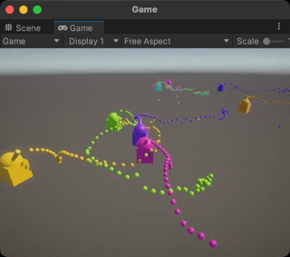
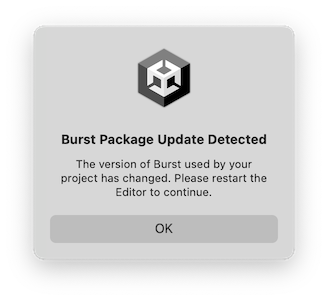
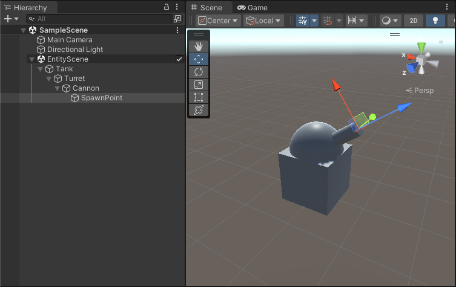
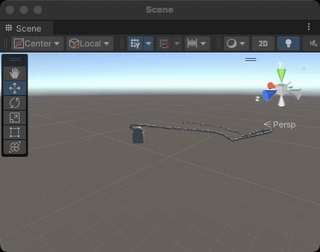
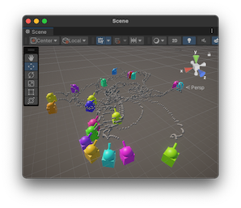
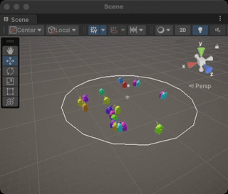

[!defmacro](NewFile, FILENAME, FOLDER, REGION)
Create a new file named "FILENAME.cs" in the folder "Scripts/FOLDER", put the following contents in there:

    [!code](Assets/Scripts/FOLDER/FILENAME.cs#REGION)
[!endmacro]
[!defmacro](ModifyFile, FILENAME, FOLDER, REGION)
Modify the file named "FILENAME.cs" in the folder "Scripts/FOLDER", like so:

    [!code-no-using](Assets/Scripts/FOLDER/FILENAME.cs#REGION)
[!endmacro]
[!defmacro](DiffFile, FILENAME, FOLDER, NAME_SRC, NAME_DST)
Modify the contents of the file named "FILENAME.cs" in the folder "Scripts/FOLDER" as follows:

    [!diff](Assets/Scripts/FOLDER/NAME_SRC, Assets/Scripts/FOLDER/NAME_DST)
[!endmacro]
[!manifest_load(Packages/manifest.json)]
# DOTS tutorial

## Overview
> What to expect from this document.

This tutorial will guide you step-by-step through the creation of a very simple demo that illustrates a range of basic DOTS concepts. In many places, features will be initially used in a non-optimal or incorrect way in order to introduce profiling and debugging tools. Do not copy parts of this tutorial into other projects without understanding the whole context first.

This tutorial is focused on the core entities package, and only makes a very basic use of entities graphics. It does not use any additional package, like physics or netcode.



The completed project contains the following "features":
- A bunch of little colored tanks moving on a flow field and spinning their turrets.
- When far enough from the origin, the tanks shoot colored projectiles.
- The projectiles bounce on the ground and despawn after a while.
- The camera follows a random tank and every press on the space bar switches to another tank.

>[!NOTE]
>We regularly update this tutorial to new (often internal) releases of the DOTS packages as they become available. Even if more recent versions are available at the time you're working through this tutorial, we recommend you use the versions from this document instead because those are the ones we tested.

Please report any issue you find with this material. Anything that is confusing, any error you run into, etc. Everything that can help us improve this tutorial is welcome. Use the #dots-training channel on Slack to that purpose.

## If you have prior experience with DOTS.
> Things can be surprising in 1.0 compared to the previously released versions of DOTS.

Ignore this section if this is your first contact with DOTS, the concepts discussed here will be introduced progressively through the rest of this tutorial.

Once the documentation is up for 1.0 and contains a migration guide from 0.50 to 1.0 we will link to it. For now, keep in mind that the following changes will surprise experienced users (non exhaustive list, feel free to contribute via Slack):

- Even though `SystemBase` still exists, unmanaged systems `ISystem` are now the recommended way of writing systems.
- `ISystem` does not support `Entities.ForEach` (and never will), instead you have the option of using "idiomatic `foreach`" for writing main thread code, or using jobs (e.g. `IJobEntity`) for parallel code.
- "Idiomatic `foreach`" simply means the built-in C# `foreach`, which is now properly integrated with ECS.
- The Entity Debugger has been removed and replaced by a series of tools to be found in the `Window > DOTS` menu.
- EntityCommandBuffer systems are now controlled by singletons ([RFC](https://unity.slack.com/archives/CQ811KGJJ/p1643662407858429)).
- Aspects are now a thing ([RFC](https://unity.slack.com/archives/CQ811KGJJ/p1635192172002600)).
- Baking replaces conversion ([FAQ](https://unity.enterprise.slack.com/files/W0192UHFHV2/F03FNH80SAU/internal_baking_faq)).
- SystemAPI is a centralized entry point to the API. ([RFC](https://unity.slack.com/archives/CQ811KGJJ/p1647360368082779))

## Required Unity Version
> Make sure you got the right one installed.

This tutorial uses **[!unity_version]**.

>[!NOTE]
>If you are using an M1 Mac, the only option to get the Apple Silicon version of the editor is through the direct link below. **The Unity Hub link will not provide the Apple Silicon version.** You can install the Intel version but that will run through Rosetta, inducing degraded performance.

To directly install the Intel based version of the editor, you can paste the following link **unityhub://[!unity_version]/[!unity_hash]** in the address bar of your browser to have it opened in the Unity Hub application.

Alternatively, you can look for that version in the list of Unity releases from the Hub itself.

Finally, you can also manually download the editor from those direct links:

- [Windows Unity Editor 64-bit](https://beta.unity3d.com/download/[!unity_hash]/Windows64EditorInstaller/UnitySetup64.exe)
- [Mac Unity Editor (Intel)](https://beta.unity3d.com/download/[!unity_hash]/MacEditorInstaller/Unity.pkg)
- [Mac Unity Editor (Apple Silicon)](https://beta.unity3d.com/download/[!unity_hash]/MacEditorInstallerArm64/Unity.pkg)
- [Linux Unity Editor](https://beta.unity3d.com/download/[!unity_hash]/LinuxEditorInstaller/Unity.tar.xz)

## Using directives
> A remark about code inlined in this tutorial.

Every code snippet in this document is automatically extracted from a reference project, and the using directives from the whole file that includes the snippet are copied. As a consequence, note that you will encounter using directives which are not yet necessary at the point where they are introduced.

Also, pay close attention to the way we explicitly reference `UnityEngine` types. This is a convention used in this tutorial to clearly delineate the DOTS related types from the classic Unity ones.

>[!NOTE]
>When working with DOTS, we strongly recommend using an IDE that automatically adds the `using` directives for you. Such an IDE is [Rider by JetBrains](https://www.jetbrains.com/rider/).

## Project setup
> Create a new project, install the packages we need, and tune the settings.


>[!WARNING]
>This step expects you to use the Unity Hub version 3. The required template will not show in older versions of the hub. If for some reason you have no choice but to use version 2, pick "Universal Render Pipeline" instead of "3D (URP) template" and skip the "Remove Readme Assets" step.

1. Create a new project in the Unity Hub, using the 3D (URP) template. You will eventually have to download the template if you haven't used it before.
1. Once the project loaded, click the button "Remove Readme Assets" in the "URP Empty Template" dialog. This will get rid of the folder "Assets/TutorialInfo" which we don't need for this tutorial.
1. Some of the packages we need will not show up in the package manager list until they are installed (even if we enable preview packages). We can only install these packages by opening `Packages/manifest.json` with a text editor and adding the following lines (be careful to preserve proper JSON syntax):
    >[!NOTE]
    >Accessing the candidates registry requires to be **connected to the VPN**.
    >If you are not a Unity employee, you should have been provided with the required packages when you were given access to this tutorial. If you suspect anything is missing, get in touch.

    >[!WARNING]
    >To be on the safe side, you should close down Unity before editing the `Packages/manifest.json` file, and reopen it to trigger the importation of the packages.
    ```
    {
      "dependencies": {
        ...
        [!manifest_lookup(com.unity.entities.graphics)],
        ...
      },
      "registry": "https://artifactory.prd.cds.internal.unity3d.com/artifactory/api/npm/upm-candidates"
    }
    ```
    >[!NOTE]
    >There are other, more user-friendly, ways of installing the packages. Modifying the package manifest is used here instead because not only we need to specify the internal candidates registry, but we also want to ensure we are using the exact version of the packages that this tutorial has been tested with.

1. If you didn't close Unity before modifying the `Packages/manifest.json` file, Unity will import the new packages immediately, and you will eventually get a Burst dialog prompting you to restart the editor. **You will also get a long list of errors in the console, and the editor will probably crash at shutdown. Just restart the editor, and everything should be fine.**<p>


1. In `Project Settings > Editor`, enable "Enter Play Mode Options" but leave the reload sub-options unchecked. For more information about what these options do, please follow these links:
    * [Unity Manual - Configurable Enter Play Mode](https://docs.unity3d.com/Manual/ConfigurableEnterPlayMode.html)
    * [Unity Blog - Enter Play Mode faster in Unity 2019.3](https://blog.unity.com/technology/enter-play-mode-faster-in-unity-2019-3)

    Pay close attention to the implication of those settings on the use of static fields (cf. blog post).<p>
    

1. In the Project window, create the missing folders from the following list in the Assets folder:
    * Prefabs
    * Scenes (already created)
    * Scripts/Aspects
    * Scripts/Authoring
    * Scripts/Components
    * Scripts/MonoBehaviours
    * Scripts/Systems
    * Settings (already created)

    

## Conversion settings
> Setup the baking pipeline properly.

The rest of this tutorial assumes that the "Scene View Mode" (in `Preferences/Entities`) is set to "Runtime Data":


## Types accessibility

This tutorial takes the convention to make all classes and structs internal. Internal types or members are accessible only within files in the same assembly, and this is the default accessibility level in C#.

When working on larger projects which are split over multiple assemblies, explicit accessibility modifiers will be required. Discussing this is out of scope for this tutorial, and isn't specific to DOTS in any way.

## Step [!counter](step) - Authoring Scene
> Create the scene from which ECS data will be constructed.

1. Make sure the SampleScene from the Scenes folder is currently open. (The following steps will only work on a scene which is saved as a file.)

1. Within the Hierarchy window, right click and select `New Subscene > Empty Scene...`. Name the new scene "Entity Scene", and put it in `Scenes/SampleScene`.<p>


[!defmacro](primitive, PARENT, MENU, NAME)
Right click "PARENT" in the Hierarchy window, select `MENU` and name the new GameObject "NAME".
[!endmacro]
1. [!macro](primitive, Entity Scene, GameObject > 3D Object > Cube, Tank) Set its Position to (0,0,0), Rotation to (0,0,0) and Scale to (1,1,1).

1. [!macro](primitive, Tank, 3D Object > Sphere, Turret) Set its **Position to (0,0.5,0)**, **Rotation to (45,0,0)** and Scale to (1,1,1).

1. [!macro](primitive, Turret, 3D Object > Cylinder, Cannon) Set its **Position to (0,0.5,0)**, Rotation to (0,0,0) and **Scale to (0.2,0.5,0.2)**.

1. [!macro](primitive, Cannon, Create Empty, SpawnPoint) Set its **Position to (0,1,0)**, **Rotation to (-90,0,0)** and Scale to (1,1,1).

1. You should now have something similar to the following screenshot.<p>


1. One last thing about that little tank is that each primitive contains by default a collider. We are not going to use those colliders, and they are discarded during baking anyway (conversion to entities) because we don't have a DOTS compatible physics engine in the project. But in the spirit of DOD, let's get rid of useless data: remove the Box Collider component from "Tank", remove the Sphere Collider component from "Turret", and remove the Capsule Collider from "Cannon". There is no collider on "SpawnPoint", so nothing to do there.<p>


## Step [!counter](step) - Turret Rotation
> Introducing the concepts of unmanaged systems (`ISystem`), queries, idiomatic `foreach`.

1. Create a new file named "TurretRotationSystem.cs" in the folder "Scripts/Systems", put the following contents in there:

    [!code](Assets/Scripts/Systems/TurretRotationSystem.cs#step1)

1. Enter play mode and notice that everything is spinning in a funny way (the cannon is progressively detaching from the rest, the animation below shows the situation after letting it run for a bit).<p>


    >[!NOTE]
    >The problem is that the `foreach` we created matches anything that has a transform, this causes every part of the tank hierarchy to rotate. We need to constrain it to only affect the rotation of the turret.

1. Leave play mode.

1. [!macro](NewFile, Turret, Components, step1)

1. [!macro](NewFile, TurretAuthoring, Authoring, step1)

1. Add the "TurretAuthoring" component to the "Turret" GameObject.

1. Check in the "Entity Conversion" panel (you might have to expand it by dragging it up) that the "Turret" component is now present on the entity.<p>


1. [!macro](DiffFile, TurretRotationSystem, Systems, TurretRotationSystem.cs#step1, TurretRotationSystem.cs#step2)

1. Enter play mode and notice that only the turret is now spinning.<p>


1. Leave play mode.

## Step [!counter](step) - Tank movement
> Introducing `SystemBase` and `Entities.ForEach` parallelism.

1. [!macro](NewFile, Tank, Components, step1)

1. [!macro](NewFile, TankAuthoring, Authoring, step1)

1. Add the "TankAuthoring" component to the "Tank" GameObject. 

1. [!macro](NewFile, TankMovementSystem, Systems, step1)

1. Enter play mode, the tank should start moving along the flow field.<p>


1. Leave play mode.

## Step [!counter](step) - Cannon Balls
> Creating a prefab, referencing entities from other entities.

1. [!macro](NewFile, CannonBall, Components, step1)

1. [!macro](NewFile, CannonBallAuthoring, Authoring, step1)

1. [!macro](primitive, SampleScene, GameObject > 3D Object > Sphere, CannonBall) Set its Position to (0,0,0), Rotation to (0,0,0) and **Scale to (0.2,0.2,0.2)**.

1. Add the "CannonBallAuthoring" component to the "CannonBall" GameObject.

1. Remove the "Sphere Collider" component from the "CannonBall" GameObject.

1. Drag & drop the "CannonBall" GameObject to the "Prefabs" folder in the Project window.

1. Delete the "CannonBall" GameObject (now a prefab instance) from "SampleScene".<p>


1. [!macro](DiffFile, Turret, Components, Turret.cs#step1, Turret.cs#step2)

1. [!macro](DiffFile, TurretAuthoring, Authoring, TurretAuthoring.cs#step1, TurretAuthoring.cs#step2)

1. Select the "Turret" GameObject, and set the new fields "CannonBallPrefab" and "CannonBallSpawn" of the "Turret Authoring" component respectively to the "CannonBall" prefab (drag & drop) from the Project folder and to the "SpawnPoint" GameObject (drag & drop from the Hierarchy window).<p>


1. [!macro](NewFile, TurretAspect, Aspects, step1)

1.
    >[!NOTE]
    >The following step uses `ComponentDataFromEntity<T>` which provides random access to typed components. For more information about this feature, check the [API Documentation](https://docs.unity3d.com/Packages/com.unity.entities@latest/index.html?subfolder=/api/Unity.Entities.ComponentDataFromEntity-1.html).
    
    [!macro](NewFile, TurretShootingSystem, Systems, step1)

1. Enter play mode, you should see the tank leaving a trail of cannon balls behind it.<p>


## Step [!counter](step) - Cannon ball movement
> Introducing parallel jobs.

1. [!macro](NewFile, CannonBallAspect, Aspects, step1)

1. [!macro](NewFile, CannonBallSystem, Systems, step1)

1. Enter play mode, the cannon balls are now moving away from the tank and bouncing on the ground.<p>


## Step [!counter](step) - Spawning many tanks
> Dealing with initialization systems that should only run once.

1. Drag & drop the "Tank" GameObject from the "Entity Scene" to the "Assets/Prefabs" folder in the Project window.

1. Delete the "Tank" GameObject (now a prefab instance) from "Entity Scene".

1. [!macro](NewFile, Config, Components, step1)

1. [!macro](NewFile, ConfigAuthoring, Authoring, step1)

1. [!macro](primitive, Entity Scene, Create Empty, Config).

1. Add the "ConfigAuthoring" component to the "Config" GameObject.

1. Select the "Config" GameObject, set the new field "TankPrefab" to the "Tank" prefab (drag & drop) from the Project folder, set "TankCount" to 20, and set "SafeZoneRadius" to 15.<p>
    

    >[!NOTE]
    >The "SafeZoneRadius" is not used yet, but will be relevant for a later step.

1. [!macro](NewFile, TankSpawningSystem, Systems, step1)

    >[!WARNING]
    >If you enter playmode at this point, you might be surprised to only see a single tank. There are actually 20 tanks, but they all spawn at the same location and move in exactly the same way.

1. [!macro](DiffFile, TankMovementSystem, Systems, TankMovementSystem.cs#step1, TankMovementSystem.cs#step2)

1. Enter play mode, each of the 20 tanks starts moving along its own flow field.<p>


1. Leave play mode.

## Step [!counter](step) - Colored tanks and cannon balls
> Advanced baking, introducing baking systems.

ECS components can control the inputs to the shaders used for rendering. Creating our own shaders (via shadergraph) and mapping custom ECS components to their inputs is out of scope for this tutorial, but we will use an already existing component called `URPMaterialPropertyBaseColor`. As the name implies, it allows controlling the base color of a standard URP material.

Our tanks are made of three primitives (tank, turret, cannon), and each of those entities need to have the `URPMaterialPropertyBaseColor` component added. We will use an approach for doing that automatically with the baking system, instead of manually modifying every authoring GameObject.

1. [!macro](DiffFile, TankAuthoring, Authoring, TankAuthoring.cs#step1, TankAuthoring.cs#step2)

1. [!macro](NewFile, TankBakingSystem, Systems, step1)

1. Enter play mode, notice that the tanks are now completely black.<p>


1. Leave play mode.

1.
    >[!NOTE]
    >The EntityCommandBuffer used by the system below requires a query to specify which entities should be targeted by SetComponentForLinkedEntityGroup.
    >The core of an entity query consists a set of component types, and the query provides a filtered view of only the entities matching that set.
    >For more information about entity queries, see the [package documentation](https://docs.unity3d.com/Packages/com.unity.entities@latest/index.html?subfolder=/manual/ecs_entity_query.html).

    [!macro](DiffFile, TankSpawningSystem, Systems, TankSpawningSystem.cs#step1, TankSpawningSystem.cs#step2)

1. Enter play mode, notice that the tanks are now randomly colored.<p>


1. Leave play mode.

1. [!macro](DiffFile, CannonBallAuthoring, Authoring, CannonBallAuthoring.cs#step1, CannonBallAuthoring.cs#step2)

1. [!macro](DiffFile, TurretAspect, Aspects, TurretAspect.cs#step1, TurretAspect.cs#step2)

1. [!macro](DiffFile, TurretShootingSystem, Systems, TurretShootingSystem.cs#step1, TurretShootingSystem.cs#step2)

1. Enter play mode, notice that the cannon balls now have the same color as the tank they spawned from.<p>


1. Leave play mode.

## Step [!counter](step) - Safe zone
> Config singleton, live conversion.

1. [!macro](NewFile, Shooting, Components, step1)

1. [!macro](DiffFile, TurretAuthoring, Authoring, TurretAuthoring.cs#step2, TurretAuthoring.cs#step3)

1. [!macro](NewFile, SafeZoneSystem, Systems, step1)

1. [!macro](DiffFile, TurretShootingSystem, Systems, TurretShootingSystem.cs#step2, TurretShootingSystem.cs#step3)

1. Enter play mode, notice that the tanks are only shooting once they get outside of the safe zone. Make sure the gizmos are enabled in the view options, otherwise you will not see the white circle.<p>


1. Still in play mode, select the "Config" authoring GameObject and modify the "Safe Zone Radius". Notice that the changes are reflected in real time thanks to "Live Conversion" (see the DOTS menu).

1. Leave play mode.

## Step [!counter](step) - Camera follow
> Simple interaction between ECS and GameObjects at runtime.

1. [!macro](NewFile, CameraSingleton, MonoBehaviours, step1)

1. Add the "CameraSingleton" MonoBehaviour to the "Main Camera" GameObject in "SampleScene".

1. [!macro](NewFile, CameraSystem, Systems, step1)

1. Enter play mode, look at the Game view (and not the Scene view as before), and notice that the camera is following one of the tanks. Make sure the Game view has input focus (click on it), and repeatedly press the spacebar. The camera should switch to another random tank every time.<p>


1. Leave play mode.

## Congratulations!

You reached the end of this tutorial! Go get some cake and celebrate!