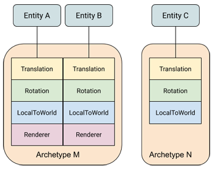

# ECS concepts

An Entity Component System (ECS) architecture separates identity (entities), data (components), and behaviour (systems). The architecture focuses on the data. Systems transform the data from an input state to an output state by reading streams of component data, which are indexed by entities.

The following diagram illustrates how these three basic parts work together:

In this diagram, a system reads Translation and Rotation components, multiplies them and then updates the corresponding LocalToWorld components. 

The fact that entities A and B have a Renderer component and entity C does not, doesn't affect the system, because the system does not care about Renderer components. (You could set up a system so that it required a Renderer component, in which case, the system would ignore the components of entity C; or, alternately, you could set up a system to exclude entities with Renderer components, in which case, it would ignore the components of entities A and B.)

## Archetypes

A unique combination of component types is called an [Archetype](xref:Unity.Entities.Archetype). For example, a 3D object might have a component for its world transform, one for its linear movement, one for rotation, and one for its visual representation. Each instance of one of these 3D objects corresponds to a single entity, but because they share the same set of components, they can be classified as a single archetype: 

In this diagram, entities A and B share archetype M, while entity C has archetype N. 

You can fluidly change the archetype of an entity by adding or removing components at runtime. For example, if you remove the Renderer component from entity B, then B moves to archetype N.

## Memory Chunks

The archetype of an entity determines where the components of that entity are stored. ECS allocates memory in "chunks," each represented by an [ArchetypeChunk](xref:Unity.Entities.ArchetypeChunk) object. A chunk always contains entities of a single archetype. When a chunk of memory becomes full, a new chunk of memory is allocated for any new entities created with the same archetype. If you change an entity archetype by adding or removing components, the components for that entity are moved to a different chunk. 

This organizational scheme provides a one-to-many relationship between archetypes and chunks. It also means that finding all the entities with a given set of components only requires searching through the existing archetypes, which are typically small in number, rather than all of the entities, which are typically much larger in number. 

The entities in a chunk are not stored in a specific order. When an entity is created or changed to a new archetype, it goes into the first chunk storing that archetype that has room. Chunks do remain tightly packed, however; when an entity is removed from an archetype, the components of the last entity in the chunk are moved into the newly vacated slots in the component arrays.

Note that the values of shared components in an archetype also determine which entities are stored in which chunk. All the entities in a given chunk have the exact same values for any shared components. If you change the value of any field in a shared component, the modified entity moves to a different chunk, just as it would if you changed that entity's archetype. A new chunk is allocated, if necessary. Use shared components to group entities within an archetype when it is more efficient to process them together. For example, the Hybrid Renderer defines its [RenderMesh component](https://docs.unity3d.com/Packages/com.unity.rendering.hybrid@latest?subfolder=/api/Unity.Rendering.RenderMesh.html)

## Entity queries

To identify which entities a system should process, you use an [EntityQuery](xref:Unity.Entities.EntityQuery). An entity query searches the existing archetypes for those having the components that match your requirements. You can specify the following component requirements with a query:

* All — the archetype must contain all of the component types in the All category.
* Any — the archetype must contain at least one of the component types in the Any category.
* None — the archetype must not contain any of the component types in the None category.

An entity query provides a list of the chunks containing the types of components required by the query. You can then iterate over the components in those chunks directly with [IJobChunk](chunk_iteration_job.md), one of the specialized ECS Jobs, or implicitly with [IJobForEach](entity_iteration_job.md) or a [non-Job for-each loop](entity_iteration_foreach.md). 

**Note:** IJobForEach implicitly creates an entity query based on the Job parameters and attributes. You can override the implicit query when scheduling the Job.  

## Jobs

To take advantage of multiple threads, you can use the Unity C# Job system. ECS provides the [JobComponentSystem](xref:Unity.Entites.JobComponentSystem), along with the specialized Job types, [IJobForEach](entity_iteration_job.md) and [IJobChunk](chunk_iteration_job.md), to transform data outside the main thread. IJobForEach (and IJobForEachWithEntity) is typically the simplest to use. IJobChunk can be used for more complex situations that IJobForEach does not handle.

These ECS Jobs use an [EntityQuery](ecs_entity_query.md) object that not only defines which components a Job accesses, but also specifies whether that access is read-only or read-write. This access-type information allows the Job scheduler to determine which Jobs it can run in parallel and which must run in sequence. Jobs that read the same data can run at the same time, but when one Job writes to data that another Job accesses, those Jobs must run in sequence. 

The order in which such sequential Jobs are run is determined by how you set up the Job dependencies. When the core ECS code calls one of your JobComponentSystem OnUpdate() functions, it passes in a JobHandle parameter that encapsulates the existing Job dependencies. When you a schedule a Job, the  Job Schedule() function returns a new JobHandle, which includes the new Job dependencies. 

## System organization

ECS organizes systems by [World](xref:Unity.Entities.World) and then by [group](xref:Unity.Enties.ComponentSystemGroup). By default, ECS creates a default World with a predefined set of groups. It finds all available systems, instantiates them, and adds them to the predefined [simulation group](xref:Unity.Entities.SimulationSystemGroup) in the default World.

You can specify the update order of systems within the same group. A group is, itslef, a kind of system, so you can add a group to a group and specify its order just like any other system. All systems within a group update before the next system or group. If you do not specify an order, systems are inserted into the update order in a deterministic manner that does not depend on creation order. In other words, the same set of systems always update in the same order within their group even when you don't explicitly specify an order. [Entity component buffer systems](xref:Unity.Entities.EntityComponentBufferSystem) 

System updates occur on the main thread. However, systems can use Jobs to offload work to other threads. [JobComponentSystems](xref:Unity.entities.JobComponentSystem) provide a straightforward way to create and schedule Jobs. 

See [System Update Order](system_update_order.md) for more information about system creation, update order, and the attributes you can use to organize your systems.

## ECS Authoring

When creating your game or application in the Unity Editor, you can use GameObjects and MonoBehaviours and create a conversion system to map those UnityEngine objects and components to entities. See [Creating Gameplay](gp_overview.md).