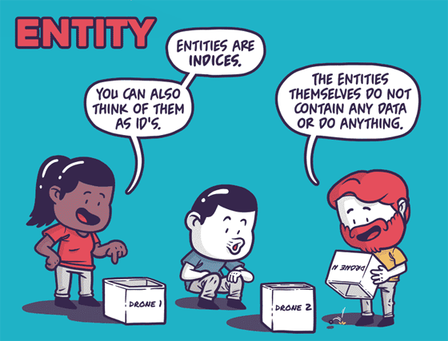

    
    
    
    
    
    
    
     
    

# Entity Component System

The Entity Component System (ECS) is the core of the Unity Data-Oriented Tech Stack. As the 
name indicates, ECS has three principal parts:

* [Entities](ecs_entities.md) — the entities, or things, that populate your game or program.
* [Components](ecs_components.md) — the data associated with your entities, but organized by 
    the data itself rather than by entity. (This difference in organization is one of the key differences 
    between an object-oriented and a data-oriented design.)
* [Systems](ecs_systems.md) — the logic that transforms the component data from its current state 
    to its next state— for example, a system might update the positions of all moving entities by their 
    velocity times the time interval since the previous frame.

