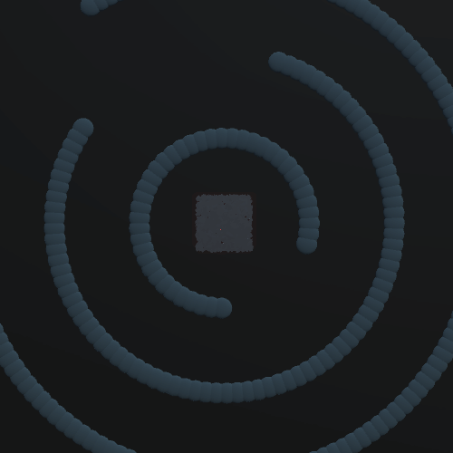
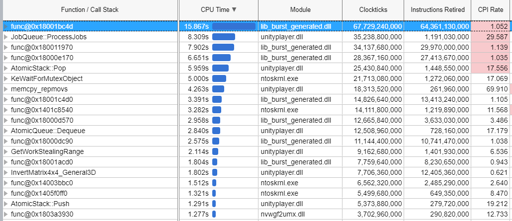
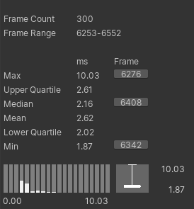
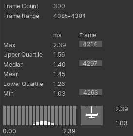
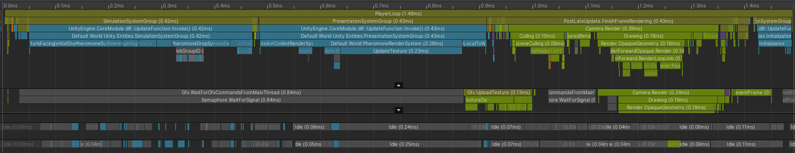
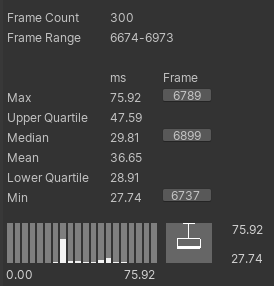
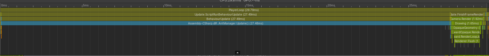
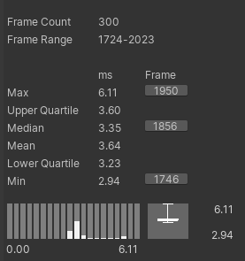
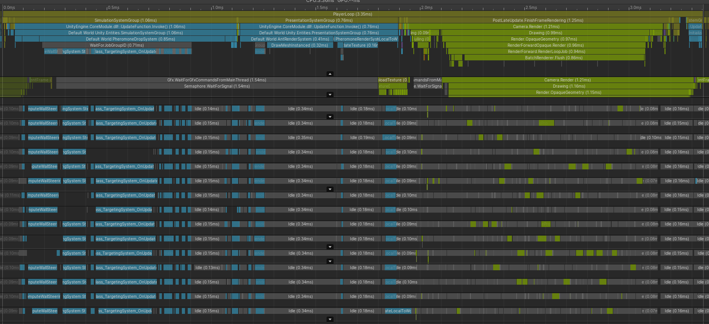

# Port Report for Ant Pheromones
This is a port of the original `AntPheromones` porject to DOTS. It targets `entities 0.2.0`, though it was first written using `entities 0.1.1` and then upgraded to try `Entities.ForEach`.

## The simulation
The project is attempting to simulate how ants might find a food source. In the beginning, a bunch of ants start in the center of a map and slowly sprawl out until they find a food source. On their every step, they drop pheromones that guide other ants. An ant that is carrying food drops slightly more pheromones, so do ants that move quickly. There are various obstacles that the ants need to navigate around to reach the end.

The general actors in this simulation are thus:
 * the nest (map center, static),
 * the food source (random position, static),
 * the ants (many; very dynamic, constantly changing position),
 * the obstacles (static),
 * the pheromone map (shared by all ants).

The pheromone map is a shared resource for all ants and must be implemented in a way that allows all the ants to write to it at some point (the original implementation solves this problem by updating all ants serially).

## Implementation using DOTS
My approach to porting the simulation over to DOTS was mostly guided by reading and understanding the core update loop of the original `AntManager` that updates the ants. This one can be cleanly separated into multiple phases that informed my choices on what components I need and what systems need to with them:
  1. Perturb the facing angle of each ant,
  2. Compute pheromone steering and obstacle based steering and adjust the facing angle and speed (the steering values can be computed in parallel),
  3. Update the render color based on per-ant brightness and whether the ant is carrying food,
  4. Check whether the ant can see its target (either food source or nest) and steer toward it if visible,
  5. Check whether the ant is close to its target and flip whether it has resources and where it is facing,
  6. Compute a velocity vector from the steering angle and speed,
  7. Adjust velocity vector such that the ant bounces of the map border,
  8. Adjust velocity and position to avoid collision with obstacles,
  9. Adjust velocity to pull the ant gently towards its goal (independent of LOS),
  10. Adjust the facing angle to point in the direction of the velocity, but do not update the speed,
  11. Drop pheromones on map depending on speed (not the velocity vector!),
  12. Decay all pheromones on the map,
  13. Compute local to world matrix for the ants,
  14. Copy over colors and matrices for rendering.

I tried to stick closely to this but naturally there will always be some difference because the original code updated ant-by-ant (so the first ant will have already dropped its pheromones when the second ant calculates its steering). My approach turned out to be suboptimal when it comes to porting time: I rebuilt the simulation from the ground up using DOTS, defined all the data nicely, implemented the systems, and then spent two days figuring out why I am seeing weird behaviour ("oh, it should be `+=` instead of `=`"). While it is _very_ helpful to have an initial plan as to what data you will be operating on and their characteristics, it is much simpler to port the simulation part-by-part.

The implementation is based on the following components:
 * `PheromoneRenderData`, `RenderData` - shared components, but merely to allow referencing `Mesh`, `Material`. These are singletons and are only used to retrieve the managed assets in the rendering systems.
 * `AntRenderSettingsComponent`, `AntSteeringSettingsComponent`, `MapSettingsComponent` - singletons with static information such as colors, map size, obstacles, position of the next and food source etc.
 * `UninitializedTagComponent`, `AntSpawnComponent` - components used to request spawning more ants and to keep track of their data
 * `HasResourceComponent` - keeps track of whether an ant is carrying resources; note that this is not a tag component. I decided to not make it a tag component since ants have almost identical behavior (with a few tweaked values) when they are carrying resources (food). It did not seem worth the cost to add and remove components to keep track of this state.
 * `FacingAngleComponent` - the facing of the ant as an angle
 * `SpeedComponent` - how fast the ant is currently moving
 * `VelocityComponent` - the velocity of the ant in this frame as a vector; this value is only used for part of the frame by multiple systems to modify the facing angle at the end of the simulation loop. The `SpeedComponent` is the authorative source on speed.
 * `WallSteeringComponent`, `PheromoneSteeringComponent`, `RandomSteeringComponent` - the steering strength of walls (obstacles), pheromones, and random influences on the facing angle of the ant
 * `PositionComponent`, `LocalToWorldComponent` - pretty much self explanatory
 * `BrightnessComponent`, `RenderColorcomponent` - each ant has a fixed brightness that is needed to compute the render color every frame.

Additionally, all obstacles on the map are stored in a `BlobAsset`. The original implementation uses a grid to do collision checking and I have adopted that implementation willingly. The obstacles are placed into all grid cells that they cover (_buckets_) which the ants then look up in every step. The pheromone map is stored as a `DynamicBuffer` of floats on a singleton entity. This decision was mainly made because the ECS system should notice which systems use the buffer, but I could not get it to collect the proper dependencies -- the jobs that operate on the pheromone map (acquired using `GetBufferFromEntity`) kept complaining about access from multiple jobs until I turned `ScheduleSingle` into `Run` for some of them.

The systems involved are in update order:
 * `AntSpawningSystem` - spawns ants when there is a `AntSpawnComponent`,
 * `PerturbFacingSystem` - randomly perturbs the facing of ants,
 * `ComputePheromoneSteeringSystem`, `ComputeWallSteeringSystem` - compute steering values,
 * `ApplySteering` - apply the previously computed steering values to update facing and speed,
 * `TargetingSystem` - check whether ant can see target and face it if visible,
 * `ResourceCarrySystem` - check whether needs to pick up/drop off resources,
 * `ComputeVelocitySystem` - compute velocity vector from speed and facing,
 * `UpdatePositionSystem` - move and make sure that it bounces of the map's edge,
 * `ObstacleCollisionSystem` - check collisions with obstacles and move ant out of them,
 * `RadialMovementSystem` - pull ants inwards or outwards depending on their target,
 * `WriteVelocityToFacingSystem` - set facing angle from computed velocity vector,
 * `PheromoneDropSystem` - drop pheromones on map,
 * `PheromoneDeacySystem` - decay pheromones on map by multiplying with a decay factor,
 * `UpdateAntColorSystem` - update ant color based on whether it is carrying resources and it's brightness,
 * `UpdateLocaltoWorldSystem`, `AntRenderSystem`, `PheromoneRenderSystem` - rendering systems

### Rendering
I decided to use the batched renderer interface using `Graphics.DrawMeshInstanced` instead of using the new hybrid renderer, since it didn't support per instance properties when I started the porting process. This is quite straight-forward since the ants only need to change color whenever they are carrying food. The color is slowly interpolated across frames per ant, which is why it is stored as a component to begin with. Each frame the color and the transform of each ant is copied for rendering since the `Graphics.DrawMeshInstanced` API requires managed arrays as inputs. Originally, I tried using `ToComponentArray` and then copying the data into a native array batch by batch, but it turns out to be much faster to skip the additional copy and use some unsafe code to directly copy from the chunks in the ECS to the managed arrays.

The static geometry (obstacles, source, nest) are still rendered from `MonoBehaviour`s.

### Notes

#### Random initialization
As mentioned before, I spent plenty of time ensuring that my simulation is close to the original. At some point I noticed that my way of initializing the position for ants leads to a very biased result:
<div style="text-align:center"></div>

The code used is essentially something like:
```csharp
void Execute(Entity entity, int index, ...) {
    var rng = new Random(((uint)index + 1) * FrameNumber);
    facingAngle.Value = rng.NextFloat() * 2 * math.PI;
```
It took some time to notice this, but I found it surprising how biased it is. I fixed it using:
```csharp
void Execute(Entity entity, int index, ...) {
    var rng = new Random(((uint)index + 1) * FrameNumber * LargePrime);
    facingAngle.Value = rng.NextFloat() * 2 * math.PI;
```
This leads to a more even distribution:
<div style="text-align:center"></div>

#### Maintaining an overview
I found myself multiple time wishing for a feature in Rider that allows me to quickly see all systems and jobs that touch a given component. This would make debugging much simpler. Similarly, the usage of `UpdateAfter` and `UpdateBefore` across many files makes it hard to keep an overview of the expected order.

#### Using an external profiler
I have used VTune briefly to poke around in the project. The inbuilt profiler does not give me any information as to what is actually slow within a job (is it compute bound? memory bound?), that would be a great improvement. The main problem with using VTune with a built player and PDBs is that Burst compiled functions do not have a helpful name, so I usually ended up comparing the source assembly and looking for any instruction sequences that stick out. It is tedious.

<div style="text-align:center"></div>


## Performance comparison
I have measured both the original project and the port in a development build with the profiler attached. With the default settings of the project (1000 ants), I measured:

<div style="text-align:center"></div>
(old)

<div style="text-align:center"></div>
(new)

The difference is a bit disappointing, but mostly comes down to the fact that there's not enough work for the worker threads to use them efficiently (see how the jobs aren't really doing anything):
<div style="text-align:center"></div>


With 20000 ants, the difference is much clearer:

<div style="text-align:center"></div>
<div style="text-align:center"></div>
(old)

<div style="text-align:center"></div>
<div style="text-align:center"></div>
(new)

As mentioned before, there are a few opportunities for optimization and points to note:
 * the main thread waits before running the job in the `PheromoneDropSystem`, since that job will write to the pheromone map in a single thread. Unfortunately, I cannot use `Entities.ForEach` with `ScheduleSingle` (that feature simply doesn't exist right now), so this job needs to run on the main thread and wait for its dependencies,
 * the time to draw the entities and update the maps is hard to get down further because it is spending the whole time on `Graphics.DrawMeshInstanced` and `Texture2d.Apply`,
 * the `TargetSystem` job takes up a bunch of time across all jobs. This thread checks line-of-sight between each ant and the food source. This information could be precomputed easily for the whole map. How I missed that is beyond me.
 * there is not really any entity that makes use of the `Transform` systems from the entity package, yet it shows up in the profiler (ends of `PresentationSystemGroup`).