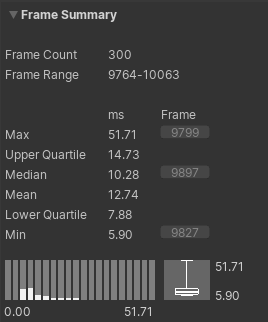
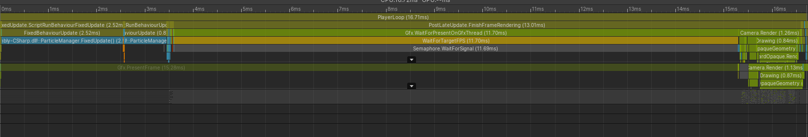
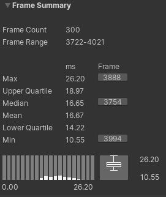
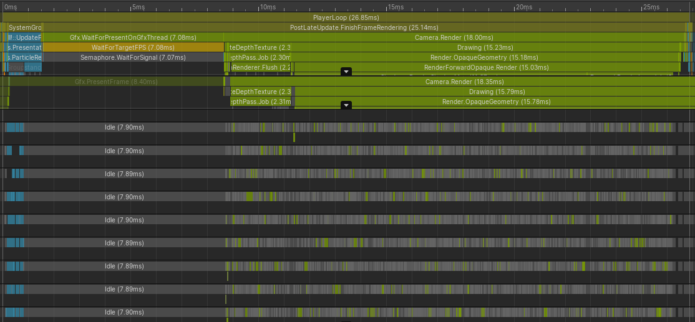
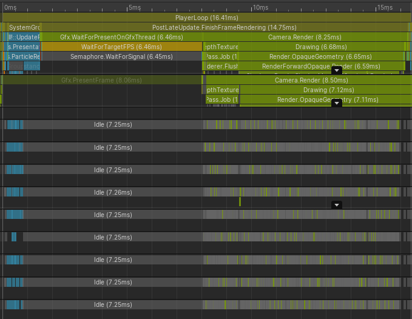

# Port Report
This is a port of the original `DistanceFieldAttractors` project to DOTS. It targets `entities 0.2.0`.


## The original project
The project simulates a bunch of particles that are attracted or repelled from the surface of a 3D model. They take on different colors depending on their position relative to the surface.

The logic in the original setup is rather straight forward:
 1. On game start, the `ParticleManager` spawns a bunch of particles. They are referred to as `Orbiters`. For rendering purposes, the particles are split into batches. There is a global choice for the current model (`DistanceField.instance`) that just takes its default value.
 2. At a fixed update rate, the `ParticleManager` updates all particle velocities and positions. The color of a particle is then determined by how far it is from the surface and whether it is inside the model or not.
 3. Every frame all meshes are drawn with a call to `Graphics.DrawMeshInstanced`. The colors are setup using `MaterialPropertyBlock`s, which might be the most interesting problem to solve to port it over to DOTS. Every once in a while, the `Update` within `DistanceField` will change to the next model.

Note that there are absolutely no interactions between the particles and virtually no shared state, which makes this a very easy target to port over to DOTS.

### Notes on the original performance

#### In-Editor Performance
<div style="text-align:center"></div>

The original implementation has a median frame time of `10.28ms` in the editor, of which about `5ms` are spent on the actual particle system:

<div style="text-align:center"></div>


#### In-Player Performance
<div style="text-align:center"></div>

The original implementation has a median frame time of `10.28ms` in the player, of which about `3ms` are spent on the actual particle system (most of it is just waiting for `vsync`):

<div style="text-align:center"></div>

Interestingly, the time required for the particle update varies quite heavily with the worst frame taking `31.55ms` to finish, with about `27.5ms` in the particle system.

<div style="text-align:center"></div>

This is very likely because there are different types of distance fields, some of which are significantly more expensive to evaluate.

## Porting it over
The central decisions I'm taking to port this over are:
 * Remove the dependency on the fixed update. The goal is to run it at a smooth 60 FPS for simulation and rendering, so a fixed update should come automatically.
 * Keep rendering using `Graphics.DrawMeshInstanced` by copying data from the ECS to an array in every frame. Using the hybrid renderer is out of the question since as of writing it does not properly support per instance data. Alternatively, it might be interesting to explore whether the color could be computed in a shader, but that might mean duplicating the somewhat brittle code for calculating the distance from the model.
 * Depend as little as possible on pre-written systems. That excludes the usage of the `Transform` systems from the entities package.
 * Keep absolutely no persistent state in any system. This means that the single distance field in the scene will have to be stored on some entity.

## The ported project
The main problem with porting this over to DOTS is the rendering. As of the time of writing, there is no support for per-instance data in the hybrid renderer. This means that I still have to use a renderer.

The DOTS version of the project consists of the following components:

 * `VelocityComponent`, `PositionComponent`, `LocalToWorldComponent` - these should be self-explanatory,
 * `PositionInDistanceFieldComponent` - stores data about the position in the distance field,
 * `RenderColorComponent` - stores render color,
 * `DistanceFieldComponent` - keeps track of which distance field model is active (singleton),
 * `SpawnParticleComponent` - component that makes particles spawn,
 * `UninitializedTagComponent` - tag component for uninitialized particles,
 * `ParticleSetupComponent` - shared component that keeps general configuration data.

The systems involved are:

Running rarely:
 * `SpawnParticleSystem` - spawn particles whenever a `SpawnParticleComponent` is found, delete the spawner, and initialize the particles.

Running continously:
 * `UpdateDistanceFieldSystem` - occasionally jump to another distance field on `DistanceFieldComponent`,
 * `UpdateParticleDistanceSystem` - check which `DistanceFieldComponent` is used and spawn a job to compute `PositionInDistanceFieldComponent` depending on the model,
 * `UpdateParticleColorSystem` - take `PositionInDistanceFieldComponent` to compute `RenderColorComponent`
 * `UpdateParticleVelocitySystem` - take `PositionInDistanceFieldComponent` to compute `VelocityComponent` and `PositionComponent`.
 * `LocalToWorldSystem` - compute TRS matrix in `LocalToWorldComponent` from `VelocityComponent` and `PositionComponent`,
 * `ParticleRenderSystem` - render particles from `LocalToWorldComponent` and `RenderColorComponent`.

Additionally, there are conversions defined for `ParticleManagerAuthoringComponent` and `DistanceFieldAuthoringComponent` to make it easier to toy around with it.

All systems are use burst and jobs.

### Porting Experience
The general porting experience was pleasant.

#### Determinism and Race Conditions
Even though DOTS goes out of its way to make you do the right thing by default, there are still plenty of ways to skrew up: Take for example this job definition (not the actual job from the project):
```csharp
struct InitializePositionsJob : IJobForEachWithEntity<PositionComponent>
{
    public Random Rng;
    public float SphereRadius;

    public void Execute(Entity entity, int index, ref PositionComponent position)
    {
        position.Value = SphereRadius * Rng.NextFloat3Direction() * Rng.NextFloat();
    }
}
```
When this job is executed, there are essentially two possibilities, neither of them are really all that great:
 * Each thread has its own copy of the job. Then the values generated by the RNG depend on the job, so the code is not deterministic.
 * All threads share a copy of the job (this is what actually seems to happeny). Then there is a race condition on the RNG.
  
Currrently, there is no warning or anything in place to catch this problem and no guideline to make sure that people get this right. This is made more difficult because the two solutions that come to mind both have their own problems:
 * If the RNG is setup per Entity, you pay for it since it is doing more than just set the seed (if you setup the RNG once, otherwise you pay with memory accesses by storing an RNG per entity).
 * If the RNG is setup per Chunk, you have to write an `IJobChunk` to emulate `IJobForEach`, and this is somewhat cumbersome.

#### Singleton Entities
Working with singleton entities feels weird. In the case of this project, I am using a singleton to store all of the global configuration data (like the `Mesh` to use etc.). This means it must be an `ISharedComponent` and you cannot get it using `GetSingleton`. It also feels very heavy to query for it every frame. Some ideas about what the ideal solution for this is would be appreciated.

#### Editor Experience
With the current workflows, it is hard to set up the scene in a way where you can continuously mirror data from a `MonoBehaviour` to an entity. All of the current ways for that feel dirty, I hope to try live link for a future version.

### Performance
The original scene with 4K particles renders smoothly and scales up to 40K in the editor. It is not exactly helpful to look at the actual graphs for 4K particles anymore since they are mostly dominated by editor overhead. In the player on the other hand, I get the following results with 40K particles:

<div style="text-align:center"></div>

The target framerate is 60fps, giving a frametime of 16.66ms. In some cases, Unity's renderer suddenly takes up more time. Here is such a worst-case frame that happens every once in a while:
<div style="text-align:center"></div>

For comparison, here is the median frame from my sample:
<div style="text-align:center"></div>

Most of the time is spent rendering shadow-maps and disabling shadows entirely solves all problems here (but unfortunately also robs the scene off some of its depth).

#### Optimizations
I have performed a few minor optimizations that I would like to highlight here:

 * many of the distance field functions had redundant computations in them that are now done once per frame for all entities; for example I schedule a single job depending on the current distance field instead of checking which distance field is active per particle,
 * usage of `math.sincos` instead of separate `sin/cos` calls,
 * some constant folding for floating point numbers that the compiler wasn't willing to perform.

Hoisting the redundant computations out of the inner loop was by far the most effective optimization since it replaces thousands of calls to trigonometric functions to just a handful.
These optimizations would have been much harder to do in the context of the original project.

#### Issues
 * Right now, the main performance culprit is rendering. The scene is using soft shadows on the particles and this takes up most of the time. I'm sure there is a clever way to fake it and not pay that price.
 * Some of the distance field code could potentially be optimized across entities in a SIMD-fashion. It's currently fairly difficult to do that without making every entity correspond to 4 particles and change everything. This might be the right move, but the work required seems unjustified when you consider that there is no guarantee to get SIMD code without intrinsics.
 * The example lacks context. The proper way to implement this would be to do it in a shader and move all work off to the GPU. 
